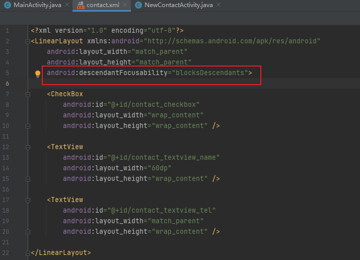
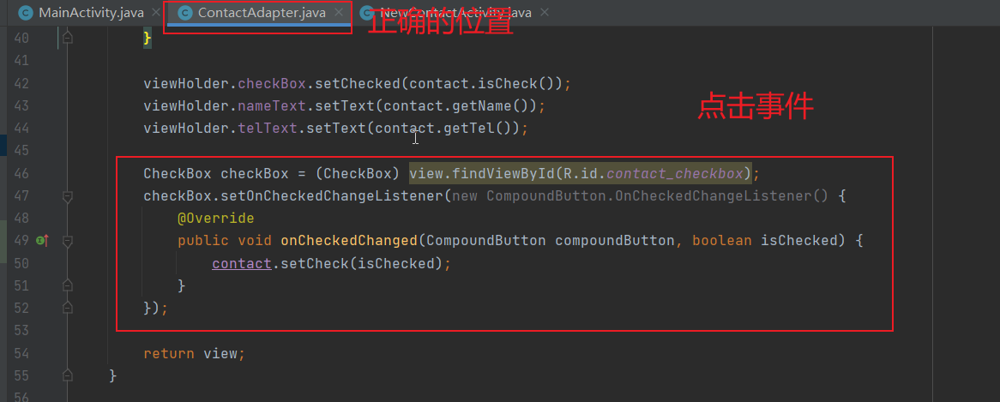

<center>
    <h3>《Android应用开发》课程</h3>  
    <h3>实验报告</h3>
    <p>
        <strong>姓名</strong> 苏桐渤 &ensp; 
        <strong>学号</strong> 2019212212236 &ensp; 
        <strong>班级</strong> 软工192
    </p>
    <p>
        <strong>实验名称</strong> 数据持久化-SQLite 数据库存储&ensp;
        <strong>实验日期</strong> 2021/11/11
    </p>

## 实验目的


了解并掌握使用 SQLite 数据库存储的基本知识。掌握使用 SQLiteOpenHelper、 SQLiteDatabase 访问数据库，以及对数据库表中的数据进行增删改查的基本方法。


## 实验内容和要求


- 了解和掌握数据库存储的基本方法与步骤；
- 掌握相关 API 的使用；
- 综合使用前面所学的活动、ListView 组件。


## 实验过程及运行结果


#### 一、布置两个活动页面的基本样式


1. 主活动页面中添加标题栏右上角的菜单。

    - 在 `res` 目录下新建 `menu` 目录，对其右键生成`menu.xml`

    

    - 文件中添加两个选项 `Add` 和 `Delete`

    

    

    ```xml
    <?xml version="1.0" encoding="utf-8"?>
    <menu xmlns:android="http://schemas.android.com/apk/res/android">
    
        <item
            android:id="@+id/menu_item_add"
            android:title="Add" />
    
        <item
            android:id="@+id/menu_item_del"
            android:title="Delete" />
    
    </menu>
    ```

    

2. 新建活动页面 `NewContactActivity`，在页面布局文件中添加对应的布局


```xml
<?xml version="1.0" encoding="utf-8"?>
<LinearLayout xmlns:android="http://schemas.android.com/apk/res/android"
    xmlns:tools="http://schemas.android.com/tools"
    android:layout_width="match_parent"
    android:layout_height="match_parent"
    tools:context=".NewContactActivity"
    android:orientation="vertical">

    <LinearLayout
        android:layout_width="match_parent"
        android:layout_height="wrap_content">

        <TextView
            android:layout_width="60dp"
            android:layout_height="wrap_content"
            android:text="姓名：" />

        <EditText
            android:id="@+id/new_contact_edittext_name"
            android:layout_width="match_parent"
            android:layout_height="wrap_content" />

    </LinearLayout>

    <LinearLayout
        android:layout_width="match_parent"
        android:layout_height="wrap_content">

        <TextView
            android:layout_width="60dp"
            android:layout_height="wrap_content"
            android:text="手机号：" />

        <EditText
            android:id="@+id/new_contact_edittext_tel"
            android:layout_width="match_parent"
            android:layout_height="wrap_content" />

    </LinearLayout>

    <Button
        android:id="@+id/new_contact_button_add"
        android:layout_width="match_parent"
        android:layout_height="wrap_content"
        android:text="添加" />

</LinearLayout>
```

3. 为主活动页面中的 `Add` 按钮添加点击事件，确保能打开另一个活动页面
    - 重写 `onOptionsItemSelected` 方法，实现活动页面之间的跳转

```java
@Override
public boolean onOptionsItemSelected(@NonNull MenuItem item) {
    switch (item.getItemId()) {
        case R.id.menu_item_add:
            // 跳转到添加联系人页面。
            Intent intent = new Intent(MainActivity.this, NewContactActivity.class);
            startActivity(intent);
            break;
        case R.id.menu_item_del
            break;
    }
    return super.onOptionsItemSelected(item);
}
```


#### 二、添加 ListView 组件


1. 创建 `contact.xml` 布局页面，并添加相关组件

    - 自定义组件中如果包含 CheckBox、EditText等需要焦点的组件，会发生抢占焦点而导致点击失效的问题
    - 在自定义组件的根中添加如下代码

    - `android:descendantFocusability="blocksDescendants"`

​	


```xml
<?xml version="1.0" encoding="utf-8"?>
<LinearLayout xmlns:android="http://schemas.android.com/apk/res/android"
    android:layout_width="match_parent"
    android:layout_height="match_parent"
    android:descendantFocusability="blocksDescendants">

    <CheckBox
        android:id="@+id/contact_checkbox"
        android:layout_width="wrap_content"
        android:layout_height="wrap_content" />

    <TextView
        android:id="@+id/contact_textview_name"
        android:layout_width="60dp"
        android:layout_height="wrap_content" />

    <TextView
        android:id="@+id/contact_textview_tel"
        android:layout_width="match_parent"
        android:layout_height="wrap_content" />

</LinearLayout>
```

2. 创建 `Contact.java ` 类，设置相关属性，`get` 和 `set` 方法。

```java
public class Contact {

    private boolean check;
    private String name;
    private String tel;

    public Contact(boolean check, String name, String tel) {
        this.check = check;
        this.name = name;
        this.tel = tel;
    }

    ...
}
```

3. 创建 `ContactAdapter.java` 作为适配器

```java
public class ContactAdapter extends ArrayAdapter<Contact> {

    private int resourceId;

    public ContactAdapter(@NonNull Context context, int resource, @NonNull List<Contact> objects) {
        super(context, resource, objects);
        this.resourceId = resource;
    }

    @Override
    public View getView(int position, @Nullable View convertView, @NonNull ViewGroup parent) {
        ...
    }
}
```

- 自定义一个内部类 `ViewHolder` ，帮助提升 ListView 的运行效率

```java
@Override
public View getView(int position, @Nullable View convertView, @NonNull ViewGroup parent) {
    Contact contact = getItem(position);

    View view;
    ViewHolder viewHolder;

    if (convertView == null) {
        view = LayoutInflater.from(getContext()).inflate(resourceId, parent, false);
        viewHolder = new ViewHolder(view.findViewById(R.id.contact_checkbox), view.findViewById(R.id.contact_textview_name), view.findViewById(R.id.contact_textview_tel));
        view.setTag(viewHolder);
    } else {
        view = convertView;
        viewHolder = (ViewHolder) view.getTag();
    }

    viewHolder.checkBox.setChecked(contact.isCheck());
    viewHolder.nameText.setText(contact.getName());
    viewHolder.telText.setText(contact.getTel());

    return view;
}

class ViewHolder {
    CheckBox checkBox;
    TextView nameText;
    TextView telText;

    public ViewHolder(CheckBox checkBox, TextView nameText, TextView telText) {
        this.checkBox = checkBox;
        this.nameText = nameText;
        this.telText = telText;
    }
}
```

- 为其中的 CheckBox 添加点击事件

```java
CheckBox checkBox = (CheckBox) view.findViewById(R.id.contact_checkbox);
checkBox.setOnCheckedChangeListener(new CompoundButton.OnCheckedChangeListener() {
    @Override
    public void onCheckedChanged(CompoundButton compoundButton, boolean isChecked) {
        contact.setCheck(isChecked);
    }
});
```

4. 在主活动页面中添加 ListView 组件。

```java
<ListView
    android:id="@+id/main_listview"
    android:layout_width="match_parent"
    android:layout_height="match_parent" />
```


#### 三、（不写数据库）实现ListView上元素的添加与删除


- 实现点击菜单中的 `Add` 完成 ListView 的添加。

```java
@Override
public boolean onOptionsItemSelected(@NonNull MenuItem item) {
    switch (item.getItemId()) {
        case R.id.menu_item_add:
            // 添加
            addContact("张三", "12580"); 
            break;
        case R.id.menu_item_del:
            // 删除
            delContact();
            break;
    }
    return super.onOptionsItemSelected(item);
}

public void addContact(String name, String tel) {
    Contact contact = new Contact(false, name, tel);
    contacts.add(contact);
    contactAdapter.notifyDataSetChanged();
}
```

- 实现点击菜单中的 `Delete` 完成 ListView 的删除

```java
public void delContact() {
    List tmp = new ArrayList<>();
    for (Contact contact : contacts) {
        if (contact.isCheck()) {
            tmp.add(contact);
        }
    }
    
    for (Contact contact : tmp) {
        contacts.remove(contact);
    }
    contactAdapter.notifyDataSetChanged();
}
```


#### 四、连接数据库，实现增删


1. 创建 `MyDatabaseHelper` 类，实现数据库表的创建

```java
public class MyDatabaseHelper extends SQLiteOpenHelper {

    public static final String CREATE_CONTACT = "create table contact (" +
            "id integer primary key autoincrement, " +
            "name text, " +
            "mobile text)";

    private Context mContext;

    public MyDatabaseHelper(@Nullable Context context, @Nullable String name, @Nullable SQLiteDatabase.CursorFactory factory, int version) {
        super(context, name, factory, version);
        mContext = context;
    }

    @Override
    public void onCreate(SQLiteDatabase db) {
        db.execSQL(CREATE_CONTACT);
        Toast.makeText(mContext, "Create succeeded", Toast.LENGTH_SHORT).show();
    }
}

```

2. 在添加联系人的活动页面中将数据写入数据库

```java
@Override
protected void onCreate(Bundle savedInstanceState) {
    super.onCreate(savedInstanceState);
    setContentView(R.layout.activity_new_contact);

    nameEdit = (EditText) findViewById(R.id.new_contact_edittext_name);
    telEdit = (EditText) findViewById(R.id.new_contact_edittext_tel);
    addButton = (Button) findViewById(R.id.new_contact_button_add);

    dbHelper = new MyDatabaseHelper(NewContactActivity.this, "contactStore.db", null, 1);

    // 按钮点击事件，添加联系人到数据库
    addButton.setOnClickListener(new View.OnClickListener() {
        @Override
        public void onClick(View view) {
            String name = nameEdit.getText().toString();
            String tel = telEdit.getText().toString();

            if (name.equals("") || tel.equals("")) {
                Toast.makeText(NewContactActivity.this, "姓名或手机号不能为空！", Toast.LENGTH_SHORT).show();
            } else {
                // 写入数据库

                SQLiteDatabase db = dbHelper.getWritableDatabase();
                ContentValues values = new ContentValues();

                values.put("name", name);
                values.put("mobile", tel);
                db.insert("contact", null, values);
                values.clear();

                finish();
            }
        }
    });
}
```

3. 在主活动页面中，重写 `onResume()` 方法，实现从添加联系人页面返回以后从数据库读取新信息。

```java
@Override
protected void onResume() {
    super.onResume();
    loadContacts();
}

public void loadContacts() {
    contacts.clear();

    SQLiteDatabase db = dbHelper.getWritableDatabase();
    Cursor cursor = db.query("contact", null, null, null, null, null, null);
    if (cursor.moveToFirst()) {
        do {
            @SuppressLint("Range") String name = 
                cursor.getString(cursor.getColumnIndex("name"));
            @SuppressLint("Range") String tel = 
                cursor.getString(cursor.getColumnIndex("mobile"));

            contacts.add(new Contact(false, name, tel));
        } while (cursor.moveToNext());
    }

    contactAdapter.notifyDataSetChanged();
}
```

4. 在主活动页面中修改删除按钮的点击响应。

```java
public void delContact() {
    SQLiteDatabase db = dbHelper.getWritableDatabase();
    for (Contact contact : contacts) {
        if (contact.isCheck()) {
            db.delete("contact", "name=? and mobile=?", new String[]{contact.getName(), contact.getTel()});
        }
    }

    loadContacts();
}
```


## 问题分析与总结


#### ListView中自定义控件的点击事件失效问题

原因：子控件中存在 `CheckBox`、`EditText` 等需要焦点的组件，这些组件会抢占整个 `Item` 的焦点。

办法：在自定义控件的 `xml` 文件的根中添加 `android:descendantFocusability="blocksDescendants"`




####  自定义控件中的子控件点击事件

都到自定义控件的份上了，相信将会不止一次使用了。

但问题是，在创建布局的时候，每个子控件，都对应有一个 `id` ，但也只有一个。如果说你在使用多个自定义控件的活动页面中，试图通过 `findViewById` 来找到这个子控件，那恐怕是要出问题的。


正确方式：在定义 控件适配器 的地方，为这些子控件添加点击事件。


