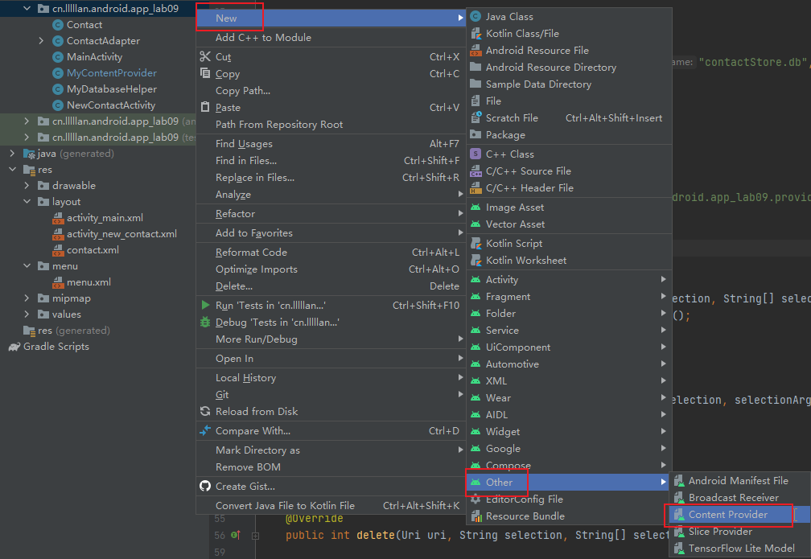
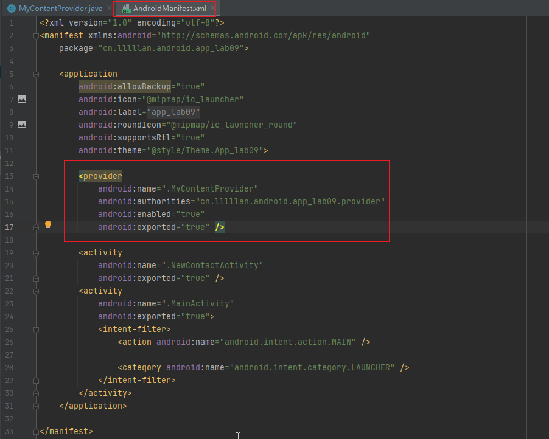
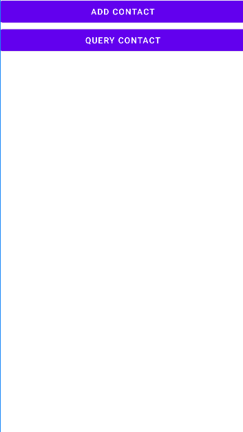
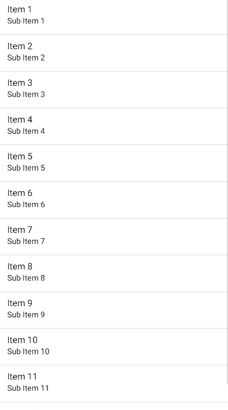

<center>
    <h3>《Android应用开发》课程</h3>  
    <h3>实验报告</h3>
    <p>
        <strong>姓名</strong> 苏桐渤 &ensp; 
        <strong>学号</strong> 2019212212236 &ensp; 
        <strong>班级</strong> 软工192
    </p>
    <p>
        <strong>实验名称</strong> &ensp;
        <strong>实验日期</strong> 2021/
    </p>

​    

## 实验目的


了解 Android 系统中的数据共享机制，通过 ContentProvider 共享数据，并通过 ContentResolver 读写共享数据的基本方法和过程。


## 实验内容和要求


（1）在实验 10 的基础上对外共享数据。 

（2）创建一个新的工程，编写客户程序，实现对共享数据进行添加和查询的功能。


## 实验过程及运行结果


### 一、在上一次作业的基础上添加内容提供器

- 新建一个内容提供器。



- 完善其中增删改查的内容，查询的限制条件由新项目写好。

```java
@Override
public String getType(Uri uri) {
    switch (uriMatcher.match(uri)) {
        case CONTACT_DIR:
            return "vnd.android.cursor.dir/vnd.cn.lllllan.android.app_lab09.provider.contact";
    }
    return null;
}

@Override
public Cursor query(Uri uri, String[] projection, String selection, String[] selectionArgs, String sortOrder) {
    SQLiteDatabase db = myDatabaseHelper.getReadableDatabase();
    Cursor cursor = null;

    switch (uriMatcher.match(uri)) {
        case CONTACT_DIR:
            cursor = db.query("contact", projection, selection, selectionArgs, null, null, sortOrder);
            break;
    }

    return cursor;
}

@Override
public Uri insert(Uri uri, ContentValues values) {
    SQLiteDatabase db = myDatabaseHelper.getWritableDatabase();
    Uri uriReturn = null;

    switch (uriMatcher.match(uri)) {
        case CONTACT_DIR:
            long contact = db.insert("contact", null, values);
            uriReturn = Uri.parse("content://" + AUTHORITY + "/contact/" + contact);
            break;
    }

    return uriReturn;
}
```

- 在`AndroidManifest.xml` 中注册内容提供器（Android Studio已帮我们完成）




### 二、新建 lab10 项目，完成其中基本的布局




### 三、完成添加事件

- 在 `AndroidManifest.xml` 中添加如下代码，其中 `name` 的内容是上一个项目中内容提供器所在的包名

```java
<queries>
    <package android:name="cn.lllllan.android.app_lab09" />
</queries>
```

- 为添加页面的添加按钮添加点击事件
    - uri 中复制内容提供器的 `AUTHORITY`
    - values 中是添加的数据信息

```java
Button btn = (Button) findViewById(R.id.add_contact_button_add);
btn.setOnClickListener(new View.OnClickListener() {
    @Override
    public void onClick(View view) {
        EditText nameEt = (EditText) findViewById(R.id.add_contact_edit_view_name);
        EditText mobileET = (EditText) findViewById(R.id.add_contact_edit_view_mobile);

        String name = nameEt.getText().toString();
        String mobile = mobileET.getText().toString();

        if (name.equals("") || mobile.equals("")) {
            Toast.makeText(AddContactActivity.this, "姓名或手机不能为空", Toast.LENGTH_SHORT).show();
        } else {
            Uri uri = Uri.parse("content://cn.lllllan.android.app_lab09.provider/contact");

            ContentValues values = new ContentValues();
            values.put("name", name);
            values.put("mobile", mobile);

            Uri newUri = getContentResolver().insert(uri, values);

            finish();
        }
    }
});
```


### 四、完成查询事件

- 为查询页面的查询按钮添加点击事件
    - query方法
        - `selection` 为查询的限制条件，作业要求为模糊查询，所以写成 `name like ?` 或 `mobile like ?`
        - `selectionArgs` 是对应的值，因为是模糊查询，所以在关键之前后加上 `%`
    - `ContactItem`类，实现接口`Serializable`，是为了让 `ArrayList<ContactItem> list` 能够作为一个参数，传递给另一个页面。

```java
Button btn = (Button) findViewById(R.id.query_contact_button_query);
btn.setOnClickListener(new View.OnClickListener() {
    @Override
    public void onClick(View view) {
        RadioButton nameRB = (RadioButton) findViewById(R.id.query_contact_radio_button_name);

        Uri uri = Uri.parse("content://cn.lllllan.android.app_lab09.provider/contact");

        EditText editText = (EditText) findViewById(R.id.query_contact_edit_view_key);
        String key = editText.getText().toString();

        String selection = (nameRB.isChecked() ? "name" : "mobile") + " like ? ";
        Cursor cursor = getContentResolver().query(uri, null, selection, new String[]{"%" + key + "%"}, null);

        ArrayList<ContactItem> list = new ArrayList<>();
        if (cursor != null) {
            while (cursor.moveToNext()) {
                @SuppressLint("Range") String name = cursor.getString(cursor.getColumnIndex("name"));
                @SuppressLint("Range") String mobile = cursor.getString(cursor.getColumnIndex("mobile"));
                list.add(new ContactItem(name, mobile));
            }
            cursor.close();
        }

        Intent intent = new Intent(QueryContactActivity.this, ContactsList.class);
        intent.putExtra("contacts", list);
        startActivity(intent);
    }
});
```


## 问题分析与总结


### E/ActivityThread: Failed to find provider info for

需要在想要获取数据的项目中，在`AndroidManifest.xml` 中添加响应代码

- 其中 `cn.lllllan.android.app_lab09`  是对应的内容提供器所在的包名

```java
<queries>
    <package android:name="cn.lllllan.android.app_lab09" />
</queries>
```


