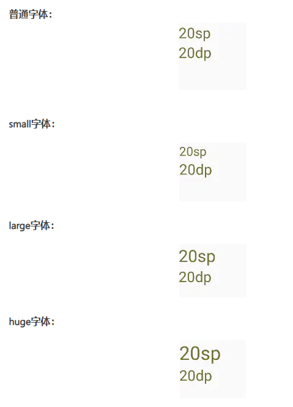

# 1 活动


## 1.1 活动的基本用法


### 1.1.1 活动的定义

- 继承 `AppCompatActivity`
- 重写 `onCreate(Bundle bundle)`

```java
public class MainActivity extends AppCompatActivity {
    @Override
    protected void onCreate(Bundle savedInstanceState) {
        super.onCreate(savedInstanceState);
        setContentView(R.layout.activity_main);
    }
}
```


### 1.1.2 活动的注册

> 所有的活动都要在 `AndroidManifest.xml` 中进行注册才能生效

```xml
<application android:...>
	<activity android:name=".MianActivity"></activity>
</application>
```


### 1.1.3 活动的启动

```java
Intent intent = new Intent(Intent.ACTION_DIAL);
// startActivity(intent);
// startActivityForResult(intent, 1);
```


## 1.2 Toast 的使用

```java
Toast.makeText(MainActivity.this, "hello world", Toast.LENGTH_SHORT).show;
```


## 1.3 Intent 及其作用

Intent——意图，它可以带有数据，在Android设备上的任何应用程序组件间相互作用，将不同组件连在一起的桥梁。

Intent作用：

- Intent最常用在启动新的Activity，不管是显式的（通过指定类来加载）还是隐式的（通过请求在一块数据上执行的动作）。
- Intent还可以用来广播消息，然后使用Broadcast Receiver来监听并响应这些Intent。
- 使用Intent来传播动作，比如通过我们的程序中打电话。


## 1.4 活动的生命周期


### 1.4.1生命周期方法

- `onCreate` 第一次被创建时候调用
- `onStart` 由不可见变为可见时候调用
- `onRecume` 应用与用户交互的状态，此时的活动位于返回栈的栈顶，并且出于运行状态
- `onPause` 系统准备去启动或者恢复其他活动时候调用
- `onStop` 在活动完全不可见时候调用。如果启动了一个对话框活动，`onPause`会被调用，而`onStop`不会
- `onDestroy` 活动被销毁之前调用
- `onRestart` 活动由停止状态变为运行状态之前调用

> **完整生存期**。活动在 `onCreate()` 方法和 `onDestroy()` 方法之间所经历的称为完整生存期。
>
> **可见生存期**。活动在 `onStart()` 方法和 `onStop()` 方法之间所经历的称为可见生存期。
>
> **前台生存期**。活动在 `onResume()` 方法和 `onPause()` 方法之间所经历的称为前台生存期


### 1.4.2 生命周期状态及其转换

- 运行状态。活动位于返回栈的栈顶
- 暂停状态。活动不位于返回栈的栈顶，但活动仍然可见
- 停止状态。活动不位于返回栈的栈顶，并且完全不可见
- 销毁状态。活动从返回栈中移除


### 1.4.3 生命周期方法的调用顺序


## 1.5 活动的启动模型

启动模式一共有4种。**standard、singleTop、singleTask**和**singleInstance**
 通过在 `AndroidManifest.xml` 中给`<activity>`标签指定`android:launchMode`属性来选择启动模式。


### 1.5.1 standard

活动的默认启动模式。在该模式下，每当启动一个新活动，它就会在返回栈中入栈，并处于栈顶的位置，并且，不管此活动是否已经存在于返回栈中，每次启动都会创建该活动的一个新实例。


### 1.5.2 singleTop

在启动活动时如果发现返回栈的栈顶已经是该活动，则认为可以直接使用它，不会再创建新的活动实例。


### 1.5.3 singleTask

每次启动该活动时系统首先会在返回栈中检查是否存在该活动的实例，如果发现已经存在则直接使用该实例，并把在这个活动之上的所有活动统统出栈，如果没有发现就会创建一个新的活动实例。


### 1.5.4 singleInstance

活动会启用一个新的返回栈来管理这个活动(其实如果singleTask模式指定了不同的taskAffinity，也会启动一个新的返回栈)。


## 1.6 活动之间的数据传递


### 1.6.1 向下一个活动传递数据

```java
button.setOnClickListener(new View.OnClickListener){
    @Override
    public void onClick(View view) {
        Intent intent = new Intent(MainActivity.this, SecondActivity.class);
       	intent.putExtra("data", "hello world");
        startActivity(intent);
    }
}
```

```java
Intent intent = getIntent();
String data = intent.getStringExtra("data");
```


### 1.6.2 返回数据给上一个活动

```java
button.setOnClickListener(new View.OnClickListener){
    @Override
    public void onClick(View view) {
        Intent intent = new Intent(MainActivity.this, SecondActivity.class); 
        startActivityForResult(intent, 1);
    }
}
```

```java
button.setOnClickListener(new View.OnClickListener){
    @Override
    public void onClick(View view) {
        Intent intent = new Intent(); 
        intent.putExtra("data", "return hello world");
        setResult(RESULT_OK, intent);
        finish();
    }
}
```


# 2 UI


## 2.1 常用控件的使用


### 2.1.1 基本属性

```xml
android:id="@+id/id"
android:layout_width="match_parent"
android:layout_height="wrap_content"
android:gravity="center"
android:textSize="24dp"
android:textColor="#000000"
android:text="hello world"
```


### 2.1.2 常用控件

- `TextView`
- `EditText`
- `Button`
- `CheckBox`


## 2.2 LinearLayout

> Android中有六大布局,分别是: LinearLayout(线性布局)，RelativeLayout(相对布局)，TableLayout(表格布局) FrameLayout(帧布局)，AbsoluteLayout(绝对布局)，GridLayout(网格布局)

```xml
<LinearLayout xmlns:android="http://schemas.android.com/apk/res/android"
              android:layout_width="match_parent"
              android:layout_height="match_parent"
              android:orientation="vertical" >
</LinearLayout>
```


## 2.3 获取组件的方法

```java
TextView textView = findById(R.id.name);
```


## 2.4 字体和长度/宽度单位

```xml
<?xml version="1.0" encoding="utf-8"?>
<font-family>
    <font android:font="@[package:]font/font_to_include"
          android:fontStyle=["normal" | "italic"]
          android:fontWeight="weight_value" />
</font-family>
```

> 1、当修改系统字体大小时，字体大小以dp为单位时，大小不变；
> 2、当修改系统字体大小时，字体大小以sp为单位时，大小跟随变化；




## 2.5 资源目录

| res  |  子目录   |                             功能                             |
| :--: | :-------: | :----------------------------------------------------------: |
|      | drawable/ | 位图文件（.png、jpg、.gif）或编译为以下 Drawable 资源子类型的 XML 文件： |
|      |  mipmap/  |           适用于不同启动器图标密度的 Drawable 文件           |
|      |  layout/  |               用于定义用户界面布局的 XML 文件                |
|      |  values/  |        包含字符串、整型数和颜色等简单值的 XML 文件。         |


# 3 碎片


## 3.1 碎片的基本概念

> 碎片是一种可以嵌入在活动当中的UI片段，它能让程序更加合理和冲锋的利用大屏幕的空间。


## 3.2 碎片的使用


### 3.2.1 碎片的定义

- 新建一个左碎片布局 `left_fragment.xml`

```xml
<LinearLayout xmlns:android="http://schemas.android.com/apk/res/android"
              android:layout_width="match_parent"
              android:layout_height="match_parent"
              android:orientation="vertical" >
    <Button/>
</LinearLayout>
```

```java
public class LeftFragment extends Fragment {
    @Override
    public View onCreateView(LayoutInflater inflater, ViewGroup container, Bundle bundle) {
        View view = inflater.inflate(R.layou.left_fragment, container, false);
        return view;
    }
}
```

- 新建一个右碎片布局 `right_fragment.xml`

```xml
<LinearLayout xmlns:android="http://schemas.android.com/apk/res/android"
              android:layout_width="match_parent"
              android:layout_height="match_parent"
              android:orientation="vertical" >
    <TextView/>
</LinearLayout>
```

```java
public class RightFragment extends Fragment {
    @Override
    public View onCreateView(LayoutInflater inflater, ViewGroup container, Bundle bundle) {
        View view = inflater.inflate(R.layou.right_fragment, container, false);
        return view;
    }
}
```

- 修改使用碎片的页面布局

```xml
<LinearLayout xmlns:android="http://schemas.android.com/apk/res/android"
              android:layout_width="match_parent"
              android:layout_height="match_parent"
              android:orientation="vertical" >
    
    <fragment android:name="cn.lllllan.android.LeftFragment"
              android:layout_width="0dp"
              android:layout_height="match_parent"
              android:layout_weight="1"/>
    
    <fragment android:name="cn.lllllan.android.RightFragment"
              android:layout_width="0dp"
              android:layout_height="match_parent"
              android:layout_weight="1"/>
    
</LinearLayout>
```


### 3.2.2 碎片的动态添加/更换

- 创建待添加的碎片实例
- 获取 Fragment Manager，在活动中可以直接通过调用 `getSupportFragment()` 方法获得。
- 开启一个事务，通过调用 `beginTransaction` 方法开启
- 想容器内添加或替换碎片，一般使用 `replace()` 方法是实现，需要传入容器的id和待添加的碎片实例
- 提交事务，调用 `commit()` 方法

```java
public class MainActivity extends AppCompatActivity implements View.onClickListener {
    @Override
    protected void onCreate(Bundle bundle) {
        super.onCreate(bundle);
        setContentView(R.layout.activity_main);
        Button button = (Button) findById(R.id.button);
        button.setOnClickListener(this);
        replaceFragment(new RightFragment());
    }
    
    @Override
    public void onClick(View view) {
        switch(view.getId()) {
            case R.id.button:
                replaceFragment(new AnotherRightFragment());
                break;
            default:
                break;
        }
    }
    
    private void replaceFragment(Fragment fragment) {
        FragmentManager fragmentManager = getSupportFragmentManager();
        FragmentTransaction transaction = fragmentManager.beginTransaction();
        transaction.replace(R.id.right_layout, fragment);
        transaction.commit();
    }
}
```


## 3.3 碎片的生命周期状态

> - 运行状态：碎片可见并且它所关联的活动正出于运行状态
> - 暂停状态：碎片所关联的活动进入暂停状态，但该碎片仍然可见
> - 停止状态：碎片所关联的活动进入停止状态，
> - 销毁状态：碎片所关联的活动被销毁，

- `onAttach()`: 碎片实例被**关联**到活动实例。碎片和活动还没有完全初始化。通常，你在该方法中获取到活动的引用，在碎片将来的初始化工作中被使用。
- `onCreate()`: 当**创建**碎片时，系统调用该方法。你需要初始化一些碎片的必要组件。这些组件是当碎片被暂停、停止时需要保留的，以便被恢复。
- `onCreateView()`: 当碎片将要**第一次绘制**它的用户界面时系统调用该方法。为了绘制碎片的UI，你需要从该方法中返回一个代表碎片根布局的View组件。如果该碎片不提供用户界面，直接返回null。
- `onActivityCreated`: 当**宿主活动被创建**，在 `onCreateView()` 方法之后调用该方法。活动和碎片实例与活动的视图层级被创建。这时，视图可以通过 `findViewById()` 方法来访问。在这个方法中，你可以实例化需要Context对象的对象。
- `onStart()`: 碎片**可见时**调用该方法。
- `onResume()`: 碎片**可交互时**调用该方法。
- `onPause()`: 当首次表明用户将要**离开碎片时**系统调用该方法。通常，这里你需要提交任何的会超出用户会话的持久化的变化。
- `onStop()`: 碎片将要**被停止时**调用。
- `onDestroyView()`: 调用该方法后，碎片将要被销毁。
- `onDestroy()`: 该方法被用来**清理碎片的状态**。但在Android平台并不保证一定被调用。


# 4 数据持久化


## 4.1 数据持久化的方法


### 4.1.1 文件存储

> 将数据原封不动地保存到文件当中，适合用于存储一些简单的文本数据或二进制数据。

```java
FileOutputStream out = openFileOutput("data", Context.MODE_PRIVATE);
BufferedWriter writer = new BufferedWriter(new OutputStreamWriter(out));
writer.write("hello wolrd");
```

```java
FileInputStream in = openFileInput("data");
BufferedReader reader = new BufferedReader(new InputStreamReader(in));
String line = "";
StringBuilder content = new StringBuilder();
while((line = reader.readLine()) != null) {
    content.append(line);
}
```


### 4.1.2 SharedPreferences 存储

> 使用键值对的方式存储数据。

使用方法详见 4.2


### 4.1.3 SQLite 数据库存储

> 轻量级的关系型数据库。适用于存储大量复杂的关系型数据。

使用方法详见4.3


### 4.1.4 LitePal数据库

> 开源的Android数据库框架，采用了对象关系映射的模式，并将常用的数据库功能进行了封装。


## 4.2 SharedPreferences


### 4.2.1 获取 SharedPreferences 对象

```java
getSharedPreferences();
getPreferences();
getDefaultSharedPreferences();
```


### 4.2.2 存储数据

- 获取 `SharePreferences.Editor` 对象
- 向该对象中添加数据
- 调用 apply() 方法将添加的数据提交

```java
SharedPreferences.Editor editor = getSharedPeferences("data", MODE_PRIVATE).edit();
editor.putString("name", "Tom");
editor.putInt("age", 28);
editor.putBoolean("married", false);
editor.apply();
```


### 4.2.3 读取数据

```java
SharedPreferences pref = getSharedPreferences("data", MODE_PRIVATE);
String name = pref.getString("name", "");
int age = pref.getInt("age", 0);,
boolean married = pref.getBoolean("married", false);
```


## 4.3 SQLite


### 4.3.1 创建数据库

```java
public class MyDatabaseHelper extends SQLiteOpenHelper {
    public static final String CREATE_BOOK = "create table book ("
        + "id integer primary key autoincrement, "
        + "author text,"
        + "price real, "
        + "pages integer, "
        + "name text)";
    
    private Context mContext;
    
    public MyDatabaseHelper(Context context, String name, SQLiteDatabase.CursorFactory factory, int version) {
        super(context, name, factory, version);
        mContext = context;
    }
    
    @Override
    public void onCreate(SQLiteDatabse db) {
        db.execSQL(CREATE_BOOK);
    }
    
    @Override
    public void onUpgrade(SQLiteDatabase db, int oldVersion, int newVersion) {
        
    }
}
```

```java
MyDatabaseHelper dbHelper = new MyDatabaseHelper(this, "BookStore.db", null, 1);
dbHelper.getWritableDatabase();
```


### 4.3.2 添加数据

```java
MyDatabaseHelper dbHelper = new MyDatabaseHelper(this, "BookStore.db", null, 1);
SQLiteDatabase db = dbHelper.getWritableDatabase();

ContentValues values = new ContentValues();
values.put("name", "Tom");
values.put...
db.insert("Book", null, values);
```


### 4.3.3 更新数据

```java
ContentValues values = new ContentValues();
values.put("name", "Jack");
db.update("Book", values, "name = ?", new String{}{"Tom"});
```


### 4.3.4 查询数据

```java
Cursor cursor = db.query("Book", null, null, null, null, null, null);
if (cursor.moveToFirst()) {
    do {
        String name = cursor.getString(cursor.getColumnIndex("name"));
        ...
    } while(cursor.moveToNext());
}
cursor.close();
```

