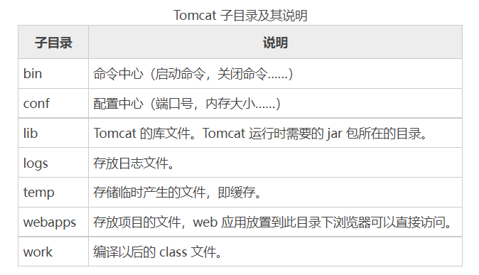
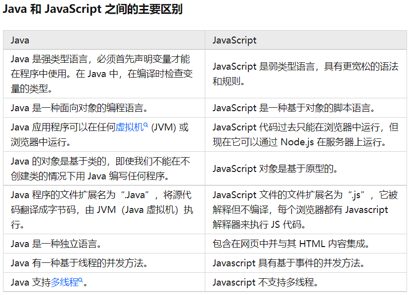
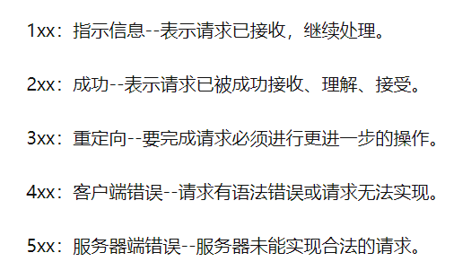
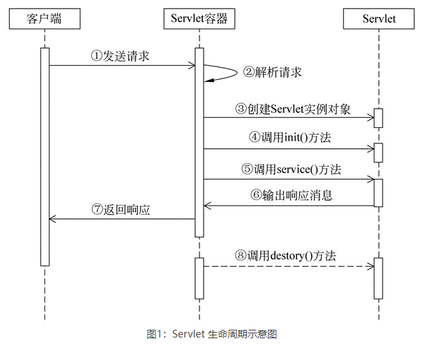

# 概述

----

### JavaEE是一种开发框架/架构

- jsp和servlet是javaee开发框架中的内容


---

### Tomcat

- 可以修改端口号
    - tomcat安装目录/conf
    - server.xml
    - 修改
    - 重启
- 目录webapps，简单部署直接将文件拖入
- 默认端口8080，web应用默认端口80
- 


----

### JSP

- 执行过程/原理
    - 客户端发出Request请求
    - JSP Container 将 JSP 转译成 Servlet 的源代码
    - 将Servlet源代码经过编译后，并加载到内存执行
    - 把结果 Resonse 至客户端
- JSP和Servlet的关系
    - JSP 文件在容器中会转成Servlet执行
    - JSP是对Servlet的一种高级封装，本质还是Servlet


---

### HTML

- 表单以及基本元素的定义和使用

    - 文本域 `<input type="text">`
    - 密码字段 `<input type="password">`
    - 单选按钮 `<input type="radio" name="sex" value="male">Male`

    - 复选框 `<input type="checkbox" name="vehicle" value="Car">I have a car`

    - 提交按钮 `<input type="submit" value="Submit">`

    - 下拉列表

        - ```html
            <select name="cars">
                <option value="volvo">Volvo</option>
                <option value="saab">Saab</option>
                <option value="fiat">Fiat</option>
                <option value="audi">Audi</option>
            </select>
            ```

    - 文本框 

        - ```html
            <textarea rows="10" cols="30">
            我是一个文本框。
            </textarea>
            ```

        

----

### JavaScript

- DOM模型
    - DOM是Javascript操作网页的接口，全称叫文档对象模型（Document Object Model）。作用是将网页转化为一个Javascript对象，从而用Javascript脚本进行各种操作（比如增删元素等）。
    - `document.getElementById()`
    - `document.getElementsByName()`
    - `document.getElementsByTagName()`
- 必须嵌在html页面中才可执行
- ajax
    - 异步发送请求
    - 局部内容的更新
    - 响应速度的提升

- XMLHttpRequest
    - 用于在后台与服务器交换数据。
    - 在不重新加载页面的情况下更新网页
    - 在页面已加载后从服务器请求数据
    - 在页面已加载后从服务器接收数据
    - 在后台向服务器发送数据


# 基本语法

---

### Java脚本 和 Js脚本

- JS脚本中可以嵌入Java脚本




---

### 响应状态码

- 200，表示成功返回响应
- 400，服务器认为客户端出现了错误，但不能明确判断为以下哪种错误时使用此错误码。
- 403，服务器理解请求的含义，但没有权限执行此请求
- 404，服务器理解请求的含义，但没有权限执行此请求
- 500，服务器内部错误




---

### JSP指令

| **指令**           | **描述**                                                |
| :----------------- | :------------------------------------------------------ |
| <%@ page ... %>    | 定义网页依赖属性，比如脚本语言、error页面、缓存需求等等 |
| <%@ include ... %> | 包含其他文件                                            |
| <%@ taglib ... %>  | 引入标签库的定义                                        |

- Page 指令

    - Page指令为容器提供当前页面的使用说明。一个JSP页面可以包含多个page指令。

    - Page指令的语法格式 `<%@ page attribute="value" %>`

    - 等价的XML格式 `<jsp:directive.page attribute="value" />`

- Include 指令
    - JSP可以通过include指令来包含其他文件。被包含的文件可以是JSP文件、HTML文件或文本文件。包含的文件就好像是该JSP文件的一部分，会被同时编译执行。
    - Include指令的语法格式 `<%@ include file="文件相对 url 地址" %>`
    - 等价的XML语法 `<jsp:directive.include file="文件相对 url 地址" />`
- Taglib 指令
    - Taglib指令引入一个自定义标签集合的定义，包括库路径、自定义标签。
    - Taglib指令的语法 `<%@ taglib uri="uri" prefix="prefixOfTag" %>`
    - 等价的XML语法 `<jsp:directive.taglib uri="uri" prefix="prefixOfTag" />`


---

### JSP动作

| 语法            | 描述                                            |
| :-------------- | :---------------------------------------------- |
| jsp:include     | 在页面被请求的时候引入一个文件。                |
| jsp:useBean     | 寻找或者实例化一个JavaBean。                    |
| jsp:setProperty | 设置JavaBean的属性。                            |
| jsp:getProperty | 输出某个JavaBean的属性。                        |
| jsp:forward     | 把请求转到一个新的页面。                        |
| jsp:plugin      | 根据浏览器类型为Java插件生成OBJECT或EMBED标记。 |
| jsp:element     | 定义动态XML元素                                 |
| jsp:attribute   | 设置动态定义的XML元素属性。                     |
| jsp:body        | 设置动态定义的XML元素内容。                     |
| jsp:text        | 在JSP页面和文档中使用写入文本的模板             |

- 常见属性

    - id属性：

        id属性是动作元素的唯一标识，可以在JSP页面中引用。动作元素创建的id值可以通过PageContext来调用。

    - scope属性：

        该属性用于识别动作元素的生命周期。 id属性和scope属性有直接关系，scope属性定义了相关联id对象的寿命。 scope属性有四个可能的值： (a) page, (b)request, (c)session, 和 (d) application。

- `<jsp:include>`动作元素

    - 把指定文件插入正在生成的页面
    - 语法格式 `<jsp:include page="相对 URL 地址" flush="true" />`

- `<jsp:forward>` 动作元素

    - 把请求转到另外的页面
    - `<jsp:forward page="相对 URL 地址" />`

- `<jsp:useBean>`动作元素

    - 用来加载一个将在JSP页面中使用的JavaBean。

    - `<jsp:useBean id="name" class="package.class" />`

    - | 属性     | 描述                                                        |
        | :------- | :---------------------------------------------------------- |
        | class    | 指定Bean的完整包名。                                        |
        | type     | 指定将引用该对象变量的类型。                                |
        | beanName | 通过 java.beans.Beans 的 instantiate() 方法指定Bean的名字。 |

    - `<jsp:setProperty>`动作元素

        - 用来设置已经实例化的Bean对象的属性

        - ```java
            <jsp:useBean id="myName" ... />
            ...
            <jsp:setProperty name="myName" property="someProperty" .../>
            ```

        - ```java
            <jsp:useBean id="myName" ... >
            ...
               <jsp:setProperty name="myName" property="someProperty" .../>
            </jsp:useBean>
            ```

        - | 属性     | 描述                                                         |
            | :------- | :----------------------------------------------------------- |
            | name     | name属性是必需的。它表示要设置属性的是哪个Bean。             |
            | property | property属性是必需的。它表示要设置哪个属性。有一个特殊用法：如果property的值是"*"，表示所有名字和Bean属性名字匹配的请求参数都将被传递给相应的属性set方法。 |
            | value    | value 属性是可选的。该属性用来指定Bean属性的值。字符串数据会在目标类中通过标准的valueOf方法自动转换成数字、boolean、Boolean、 byte、Byte、char、Character。例如，boolean和Boolean类型的属性值（比如"true"）通过 Boolean.valueOf转换，int和Integer类型的属性值（比如"42"）通过Integer.valueOf转换。 　　value和param不能同时使用，但可以使用其中任意一个。 |
            | param    | param 是可选的。它指定用哪个请求参数作为Bean属性的值。如果当前请求没有参数，则什么事情也不做，系统不会把null传递给Bean属性的set方法。因此，你可以让Bean自己提供默认属性值，只有当请求参数明确指定了新值时才修改默认属性值。 |

    - `<jsp:getProperty>`动作元素

        - 提取指定Bean属性的值，转换成字符串，然后输出

        - ```java
            <jsp:useBean id="myName" ... />
            ...
            <jsp:getProperty name="myName" property="someProperty" .../>
            ```

        - | 属性     | 描述                                   |
            | :------- | :------------------------------------- |
            | name     | 要检索的Bean属性名称。Bean必须已定义。 |
            | property | 表示要提取Bean属性的值                 |


---

### Include指令 和 Include动作


同：

- 最终执行结果相同，都想将别的文件内容包含到当前文件中来

异：

- include指令，静态包含：
    - `<%@include file="文件的URL">`
    - 在转换成java文件的时候将包含文件的内容“复制”到主体文件，然后作为整体编译。
    - 不同文件中不允许存在相同的变量，因为要合到一个文件中一起编译。
- include动作，动态包含：
    - `<jsp:include page="文件的URL"/>`
    - 对每个jsp文件分别转换、分别编译。
    - 不同文件中允许存在相同的变量，反正是分开编译。


# 内置对象

---

### request 对象的使用

- 设置字符编码

    - ```java
        request.setCharacterEncoding("utf-8");


- 获取参数，返回的是String,  用于读取提交的表单中的值

    - 单值参数的获取 `request.getParameter("")`
    - 多值参数的获取 `request.getParameterValues("")`

- 获取属性，返回的是Object，需进行转换,可用setAttribute设置成任意对象

    - `request.getAttribute("")`
    - `request.setAttribute("") = ;`

- 读取 Cookie 

    - 获取cookie数组：`cookies = request.getCookies()`

    - 遍历数组：

        - ```java
            for (Cookie cookie : cookies) {
                String name = cookie.getName();   // 参数名
                String value = cookie.getValue(); // 参数值
            }
            ```


---

### response 对象

- 添加 Cookie
    - ```java
        Cookie cookie = new Cookie("参数名", "参数值");
        cookie.setMaxAge(60);       // 设置60秒的过期时间
        response.addCookie(cookie); // 将cookie添加到response中
        ```

- 读取 Cookie ，参考 request 部分

- 删除 Cookie

    - 通过 request 获取cookie后对其过期时间设置为0

    - ```java
        cookie.setMaxAge(0);        // 设置cookie已经过期
        response.addCookie(cookie); // 重新添加到response中
        ```

- 设置响应头

    - 设置响应内容的类型 `response.setContentType("text/html;charset=utf-8");`
    - 设置响应的编码集 `response.setCharacterEncoding("utf-8")`

- 重定向 `response.sendRedirect("http://www.baidu.com")`

- 重定向和转发的区别：

    - |          |             重定向             |                             转发                             |
        | :------: | :----------------------------: | :----------------------------------------------------------: |
        |   代码   |  `response.sendRedirect("")`   | `RequestDispatcher Dis = request.getRequestDispatcher("");`<br>`Dis.forward(request, response);` |
        |   效果   |        都会打开目标网页        |                       都会打开目标网页                       |
        |  地址栏  | 地址栏内容会改成目标网页的网址 |                      地址栏内容不会改变                      |
        | 数据共享 |    不能共享request中的内容     |                   可以共享request中的内容                    |

        

---

### session

| 方法                                         | 说明                                                         |
| -------------------------------------------- | ------------------------------------------------------------ |
| void setAttribute(String name, Object value) | 将参数名和参数值存放在 session 对象中                        |
| Object getAttribute(String name)             | 通过 name 返回获取相应的 value 值，如果 name 没有相应的 value 值，则返回 null |
| void removeAttribute(String name)            | 删除指定的 name 参数                                         |
| Enumeration getAttributeNames()              | 获取 session 对象中存储的所有参数                            |
| long getCreationTime()                       | 返回 session 对象创建的时间                                  |
| String getId()                               | 获取 session 对象的 ID 值                                    |
| boolean isNew()                              | 用于检查 session 对象是不是新对象，如果客户端禁用了 cookie ，则 session.isNew() 始终返回 true |
| void invalidate()                            | 终止 session，即指定 session 对象失效                        |
| void setMaxInactiveInterval()                | 设置 session 对象的有效时间，单位：秒                        |
| int getMaxInactiveInterval()                 | 获取 session 对象的有效时间，单位：秒                        |
| long getLastAccessedTime()                   | 获取上次访问 session 对象的时间                              |


---

### application

| 方法                                   | 说明                                                         |
| -------------------------------------- | ------------------------------------------------------------ |
| getAttribute( String arg)              | 获取 application 对象中含有关键字的对象                      |
| getAttributeNames()                    | 获取 application 对象的所有参数名字                          |
| getMajorVersion()                      | 获取服务器支持 Servlet 的主版本号                            |
| getMinorVersion()                      | 获取服务器支持 Servlet 的从版本号                            |
| removeAttribute(java.lang.String name) | 根据名字删除 application 对象的参数                          |
| setAttribute(String key,Object obj)    | 将参数 Object 指定的对象 obj 添加到 application 对象中，并 为添加的对象指定一个索引关键字 |


----

### 属性管理

1. 属性范围

|             | 范围                                                         |
| ----------- | ------------------------------------------------------------ |
| pageContext | 当前页，一个属性只能在一个页面中取得，跳转到其他页面无法取得 |
| request     | 一个页面中设置的属性在经过了服务器跳转后的页面可以继续取得   |
| session     | 一个用户设置的内容，只要是与此用户相关的页面都可以访问       |
| application | 在整个服务器上设置的属性，所有人都可以访问                   |

2. 属性操作方法

| 方法                                               | 描述     |
| -------------------------------------------------- | -------- |
| public void setAttribute(String name,Object value) | 设置属性 |
| public object getAttribute(String name)            | 取得属性 |
| public void removeAttribute(String name)           | 删除属性 |


---

### JSP和Servlet中内置对象的获取方式

|             |                    JSP                     |                        Servlet                         |
| :---------: | :----------------------------------------: | :----------------------------------------------------: |
|   request   |                 可直接使用                 |                       可直接使用                       |
|  response   |                 可直接使用                 |                       可直接使用                       |
|   session   |                 可直接使用                 |      `HttpSssion session = request.getSession();`      |
|   cookie    | `Cookie[] cookies = request.getCookies();` |       `Cookie[] cookies = request.getCookies();`       |
| application |                 可直接使用                 | `ServletContext application=this.getServletContext();` |


# Servlet

---

### Servlet 的定义方法

- 继承 `HttpServlet`
- 重写 `doGet` `doPost` 方法，抛出 `ServletException` `IOException` 异常

```java
@WebServlet("/MyServlet") // 路径配置
public class 类名 extends HttpServlet {
    @Override
    protected void doGet(HttpServletRequest request, HttpServletResponse response) throws ServletException, IOException {
        System.out.println("---------doGet-------"); 
    }
 
    @Override
    protected void doPost(HttpServletRequest request, HttpServletResponse response) throws ServletException, IOException {
        System.out.println("---------doPost-------"); 
    }    
}
```


---

### Servlet 的生命周期方法

- Servlet 初始化后调用 `init()` 方法
- Servlet 调用 `service()` 方法来处理客户端的请求
- Servlet 销毁前调用 `destroy()` 方法




---

### Servlet 配置

两种方式：

- 使用注解：

```java
@WebServlet("/MyServlet") // 路径配置
public class 类名 extends HttpServlet { }
```

- 配置 `web.xml`，（反正也记不住，不写了）


---

### Servlet 中各种对象的获取

- out对象，即输出流

```java
PrintWriter out = response.getWriter();
```

- session对象

```java
HttpSssion session = request.getSession();
```

- 请求转发

 ```java
 RequestDispatcher dispatcher = request.getRequestDispatcher("/ResultServlet"); // 目标路径或文件
 dispatcher.forward(request,response);
 ```


# JavaBean

---

### `<jsp:useBean>`

```java
<jsp:useBean id="name" class="package.javabean.class" scope="page" />
// id 定义唯一表示，随便取个名就是了
// class 定义的 JavaBean 的类
// scope 作用域
```


### `<jsp:getProperty>`

```java
<jsp:getProperty name="name" property="属性名" />
```


### `<jsp:setProperty>`

```java
<jsp:setProperty name="name" property="属性名" value="属性值"/>
```


----

### JavaBean 定义规则和使用

- JavaBean 类必须是一个公共类 - `public`
-  类中必须有一个无参构造函数
- 类中的变量都必须是私有变量 - `private`
- 为每一个属性提供 `get` `set` 方法

```java
public class Student {
    private int age;
    
    public Student() { }
    
    public int getAge() {
        return age;
    }

    public void setAge(int age) {
        this.age = age;
    }
}
```


---

### MVC 设计模式及优点

MVC设计模式：一种软件架构模式，把软甲系统分为：模型（Model）、试图（View）、控制器（Controller）三个基本部分。实现了显示模块与功能模块的分离，提高了程序的可维护性、可移植性、可扩展性、可重用性，降低了程序的开发难度。

优点：

- 低耦合：视图层和业务层分离，允许更改视图层代码而不用重新编译模型和控制器代码。
- 高重用性和可使用性：允许使用不同的试图来访问同一个服务端的代码
- 较低的生命周期成本：开发和维护的技术含量降低
- 快速的部署：不同模块的开发人员可以专注于自己负责的模块
- 可维护性：分离视图层和业务逻辑层使得应用更易于维护和修改


# 其他

---

### EL表达式

- 基本语法

 ```html
 ${EL表达式}
 ```

- 算术运算

| EL算术运算符 | 说明 |  范例  | 结果 |
| :----------: | :--: | :----: | :--: |
|      +       |  加  | ${5+2} |  7   |
|      -       |  减  | ${5-2} |  3   |
|      *       |  乘  | ${5*2} |  10  |
|   / 或 div   |  除  | ${5/2} |  2   |
|   % 或 mod   | 求余 | ${5%2} |  1   |

- 比较运算

| EL比较运算符 |   说明   |                       范例                        |    结果     |
| :----------: | :------: | :-----------------------------------------------: | :---------: |
|   == 或 eq   |   等于   | ${6==6} 或 ${6 eq 6} ${"A"="a"} 或 ${"A" eq "a"}  | true false  |
|   != 或 ne   |  不等于  | ${6!=6} 或 ${6 ne 6} ${“A"!=“a”} 或 ${“A” ne “a”} | false true  |
|   < 或 lt    |   小于   |  ${3<8} 或 ${3 lt 8} ${"A"<"a"} 或 ${"A" lt "a"}  |  true true  |
|   > 或 gt    |   大于   |  ${3>8} 或 ${3 gt 8} ${"A">"a"} 或 ${"A" gt "a"}  | false false |
|   <= 或 le   | 小于等于 | ${3<=8} 或 ${3 le 8} ${"A"<="a"} 或 ${"A" le "a"} |  true true  |
|   >= 或 ge   | 大于等于 | ${3>=8} 或 ${3 ge 8} ${"A">="a"} 或 ${"A" ge "a"} | false false |

- 逻辑运算

| EL逻辑运算符 | 说明 |             范例              | 结果  |
| :----------: | :--: | :---------------------------: | :---: |
|  && 或 and   |  与  | ${2>1&&3<4 } 或 ${2>1and3<4 } | true  |
|  \|\| 或 or  |  或  | ${2<1\|\|3>4} 或 ${2<1or3>4}  | false |
|   ! 或 not   |  非  |   ${!(2>4)} 或 ${not (2>4)}   | true  |

- 其他反正也记不住


---

### 自定义标签库

哈哈不管了


---

### JSTL

- c:out

```html
<c:out value="Hello World"></c:out>
```

- c:if

```html
<c:set var="salary" scope="session" value="${2000 * 2}"/>
<c:if test="${salary > 2000}">
   <p>我的工资为: <c:out value="${salary}"/><p>
</c:if>
```

- c:foreach

```html
<c:forEach var="i" begin="1" end="5" step="1">
   Item <c:out value="${i}"/><p>
</c:forEach>
```

- c:fortokens，通过置顶分隔符将字符串分割

```html
<c:forTokens items="google,runoob,taobao" delims="," var="name">
   <c:out value="${name}"/><p>
</c:forTokens>
```


---

### 常用组件

不知道


---

### JDBC

- 加载驱动

```java
//加载MySql驱动
Class.forName("com.mysql.jdbc.Driver")
```

- 获得数据库连接

```java
Connection conn = DriverManager.getConnection("jdbc:mysql://127.0.0.1:3306/imooc", "root", "root");
```

- 操作数据库

```java
Statement stmt = conn.createStatement();
ResultSet rs = stmt.executeQuery("SELECT user_name, age FROM imooc_goddess");
//如果有数据，rs.next()返回true
while(rs.next()){ }
```


---

### Spring框架、IoC

更不懂了
