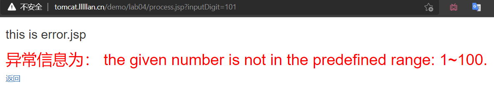

<center>
    <h2>《JSP/Servlet程序设计》课程</h2>  
    <h2>实验报告</h2>

**姓名** 苏桐渤 &ensp; **学号** 2019212212236 &ensp; **班级** 软工192
**实验名称** JSP动作实验 &ensp; **实验日期** 2021/09/27
</center>

#### 实验目的

掌握怎样在 JSP 页面中使用 include 标记动态加载文件；使用forward 实现页面的转向。

---

#### 实验要求

生掌握怎样在 JSP 页面中使用 include 标记动态加载文件；使用forward 实现页面的转向。

---

#### 实验内容与步骤

1. 创建五个界面，并写好界面雏形
- one.jsp

```html
<form class="form-horizontal" action='process.jsp' method='GET' onsubmit="return formSubmit();">

    <div class="form-group">
        <label for="inputDigit" class="col-sm-4 control-label">请输入1-100的整数：</label>
        <div class="col-sm-4">
            <input class="form-control" id="inputDigit" name="inputDigit" placeholder="1">
        </div>
        <button type="submit" class="btn btn-default">提交</button>
    </div>

</form>
```


- 单独创建一个界面，用来写返回 one.jsp 的按钮

```html
<a href="index.jsp" target="_self">返回</a>
```

- two.jsp three.jsp error.jsp，做个样子，先不管参数的接收。

```html
<div class="container">
    <h3>this is two.jsp</h3>

    <h2 style="color: red;">
        接收到的数字为：
    </h2>

    <%@ include file="link.jsp" %>
</div>
```


2. 编写提交函数，在输入不为空的条件下允许提交。

```js
function formSubmit() {
    console.log($("#inputDigit").val());
    return $("#inputDigit").val() != "";
}
```

3. process.jsp 页面处理参数

- 获取表单中的内容

```java
String text = request.getParameter("inputDigit"); 
```

- 根据要求，写一份伪代码

```java
if 数字
    if in [1, 50]
        link to two.jsp
    else if in [51, 100]
        link to three.jsp
    else 
        link to error.jsp
        echo "the given number is not in the predefined range: 1~100."
else 
    link to error.jsp
    echo "For input String: "
```

- 逐步实现伪代码

```java
try {
    int num = Integer.parseInt(text);
    
    if (num >= 1 && num <= 100) {
        url = (num > 50) ? "three.jsp" : "two.jsp";
        
        %>
        <jsp:include page="<%=url%>">     
            <jsp:param value="<%=text%>" name="digit" />
        </jsp:include>
        <%

    } else {

        %>
        <jsp:include page="error.jsp">     
            <jsp:param value="the given number is not in the predefined range: 1~100." name="msg" />
        </jsp:include>
        <%

    }

} catch (Exception e) {
    String msg = "For input String: \"" + text + "\"";
    %>
    <jsp:include page = "error.jsp">     
        <jsp:param value="<%=msg%>" name="msg" />
    </jsp:include>
    <%
}
```



