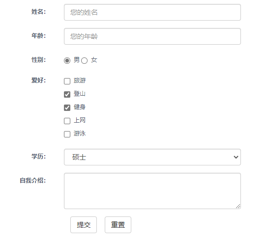
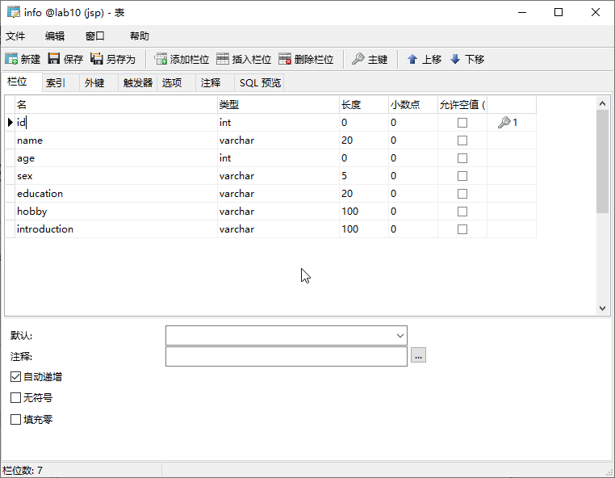
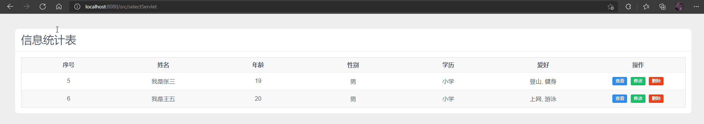
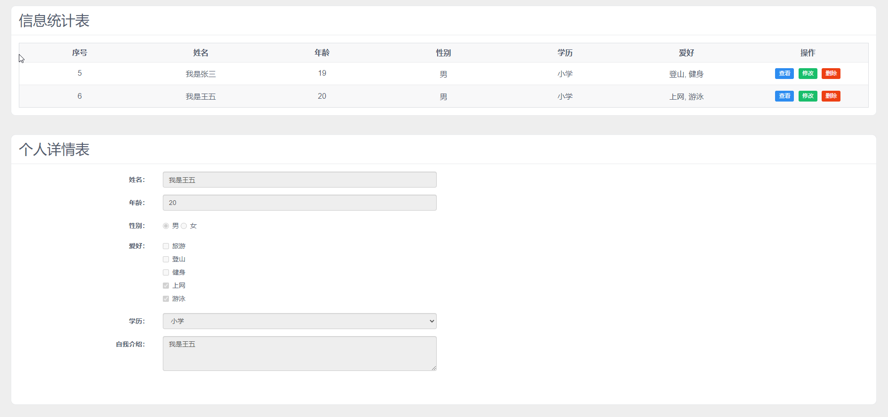
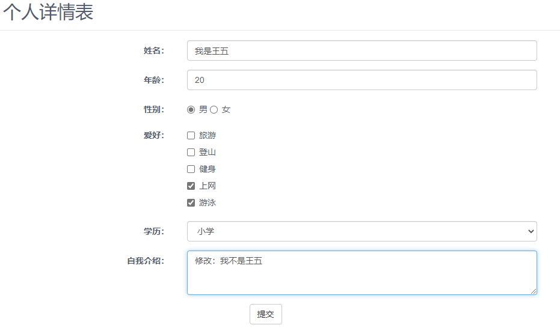

<center>
    <h3>《JSP/Servlet程序设计》课程</h3>  
    <h3>实验报告</h3>
 	<p>
        <strong>姓名</strong> 苏桐渤 &ensp; 
        <strong>学号</strong> 2019212212236 &ensp; 
        <strong>班级</strong> 软工192
    </p>
    <p>
        <strong>实验名称</strong> &ensp;
        <strong>实验日期</strong> 2021/
    </p>
</center>

## 实验目的


熟悉 JDBC 相关类与接口，掌握使用 JDBC 访问数据库完成增删 改查操作的基本方法。


## 实验要求


熟悉 JDBC 相关类与接口，掌握使用 JDBC 访问数据库完成增删 改查操作的基本方法。


## 实验内容与步骤


### 一、使用往次作业的页面 `investigation.jsp`




### 二、根据表单内容创建数据库和表




### 三、定义Servlet类接收表单数据并保存到数据库


- 设置字符集 `UTF-8` 避免中文乱码的问题
- 通过 `request.getParameterValues` 接收表单数据
- JDBC写进数据库
- `requestDispatcher.forward` 跳转页面

```java
// ...
 
Class.forName("com.mysql.jdbc.Driver");
System.out.println("数据库驱动加载成功");

Connection conn = DriverManager.getConnection("jdbc:mysql://localhost:3306/lab10", "root", "root");
System.out.println("数据库连接成功");

Statement stmt = conn.createStatement(ResultSet.TYPE_SCROLL_SENSITIVE, ResultSet.CONCUR_READ_ONLY);

String sql = "insert info value(null, '" + name + "'," + age + ",'" + sex + "','" + education + "','" + hobby + "','" + introduction + "')";
stmt.executeUpdate(sql);

if (stmt != null) stmt.close();
if (conn != null) conn.close();
```

- **添加失败的提示信息不会弄**


#### 四、页面显示数据库中所有信息


1. 定义 Servlet 类查询数据库并保存到 JavaBean 中
    - Info类，用于保存单条记录
    - InfoList 类，用于保存所有的 Info
    - Servlet将查询到的所有数据保存到 InfoList 并传参到显示页面

```java
String sql = "select * from info";
ResultSet rs = stmt.executeQuery(sql);

List<Info> list = new ArrayList<>();

while (rs.next()) {
    // ...

    Info info = new Info(id, name, age, sex, education, hobby, introduction);
    list.add(info);
}

InfoList infoList = new InfoList(list);

if (rs != null) rs.close();
if (stmt != null) stmt.close();
if (conn != null) conn.close();

HttpSession session = request.getSession();
session.setAttribute("list", infoList);
RequestDispatcher requestDispatcher = request.getRequestDispatcher("listInfos.jsp");
requestDispatcher.forward(request, response);
```

```java
<%
    InfoList infoList = (InfoList) session.getAttribute("list");
    ArrayList<Info> list = (ArrayList) infoList.getInfoList();
%>
```

2. 页面布局，采用 iview 的表格，获取所有数据后载入表格显示

```java
<Card style="margin: 40px; border-radius: 10px">
    <h2 slot="title">信息统计表</h2>
    <i-table stripe :height="height" :columns="col" :data="data">

    	<template slot-scope="{ row, index }" slot="action">
        	<i-button type="primary" size="small" style="margin-right: 5px" @click="show(index)">查看</i-button>
            <i-button type="success" size="small" style="margin-right: 5px" @click="edit(index)">修改</i-button>
            <i-button type="error" size="small" @click="remove(index)">删除</i-button>
     	</template>
 	</i-table>
</Card>
        
// ...
        
created: function () {
    var tmp = [];
    <%
    for (Info info : list) {
    %>
        var info = {
            id: '<%=info.getId()%>',
            name: '<%=info.getName()%>',
            age: '<%=info.getAge()%>',
            sex: '<%=info.getSex()%>',
            education: '<%=info.getEducation()%>',
            hobby: '<%=info.getHobby()%>',
            introduction: '<%=info.getIntroduction()%>',
        };
        tmp.push(info);
    <%
    }
    %>
    this.data = tmp;
    this.height = Math.max(this.data.length * 48 + 42, 90);
},
```



### 五、完成查看、修改和删除功能


1. 查看：沿用添加的表单在页面下方显示数据内容，添加 `disabled` 禁用输入框的编辑
2. 编辑：在查看的基础上解除 `disabled` 允许编辑，点击按钮后提交 `updateServlet` 进行修改
3. 删除：按钮点击后提交 `deleteServlet` 进行删除，同时更新页面内容

```java
show: function (index) {
    this.editAble = false;
    this.showData = this.data[index];
    this.formData.id = this.showData.id;
    this.formData.name = this.showData.name;
    this.formData.age = this.showData.age;
    this.formData.sex = this.showData.sex;
    this.formData.education = this.showData.education;
    this.formData.hobby = this.showData.hobby;
    this.formData.introduction = this.showData.introduction;
},
edit: function (index) {
    this.show(index);
    this.editAble = true;
},
remove: function (index) {
    $.ajax({
        type: 'POST',
        url: 'deleteServlet',
        data: {_id: this.data[index].id},
        success: function (res) {
            console.log(res);
        }
    });
    this.data.splice(index, 1);
    this.height = Math.max(this.data.length * 48 + 42, 90);
},
```





## 总结与问题分析


### JavaBean 的使用

​	使用 Info 类保存单条数据，但是如果存在多条数据，就需要借助 **集合类** 来保存。所以一开始啥都没想就又创建了一个 InfoList 类来专门保存所有的 Info 类。后来写实验报告的时候觉得好像不必要，只要存到创建的 `ArrayList` 中，然后直接通过 session 传参，也能达到目的。


### Servlet的使用

​	光知道通过表单提交数据，然后到 Servlet 页面获取表单数据；处理以后再跳转到别的页面的用法。

​	做实验的时候通过百度和尝试，知道可以在 Servlet 页面将处理好的数据输出到页面；在 jsp 页面中通过 **POST**

 方法获取 Servlet 中的内容。


### Vue 和 Iview 的使用

​	jsp的指令和Servlet的应用让人觉得还算好用，但是代码中到处都写满了 `<%%>` 多少有点繁琐。以及html的页面布局和js的事件处理，在做这次作业的 **查看、编辑、删除** 的时候，显得有些笨重。

​	所以用了先前自学了一点的 Vue 来做这次作业，用 Iview 中的表格来显示数据，算是体会到了组件带来的便利

