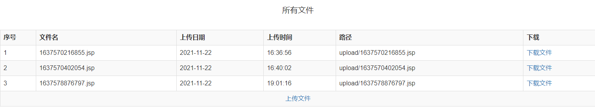

<center>
    <h3>《JSP/Servlet程序设计》课程</h3>  
    <h3>实验报告</h3>
 	<p>
        <strong>姓名</strong> 苏桐渤 &ensp; 
        <strong>学号</strong> 2019212212236 &ensp; 
        <strong>班级</strong> 软工192
    </p>
    <p>
        <strong>实验名称</strong> &ensp; JSP 中的文件上传与下载
        <strong>实验日期</strong> 2021/11/22
    </p>
</center>


## 实验目的


熟悉 JSP 中文件上传组件的配置与使用，掌握如何使用 Commons-FileUpload 组件完成文件上传的方法。


## 实验要求


熟悉 JSP 中文件上传组件的配置与使用，掌握如何使用 Commons-FileUpload 组件完成文件上传的方法。


## 实验内容与步骤


1. `index.jsp` 页面基本布局

```jsp
<h3>上传文件</h3>
<form action="UploadServlet" method="post" enctype="multipart/form-data">
    <input type="file" name="file" size="50"/> <br/> <br/>
    <input type="submit" value="上传"/>
    <button type="button" onclick="reset()">重置</button>
</form>

<script>
    function reset() {
        $("input[name=file]").val();
    }
</script>
```


2. 创建连接数据库和操作的类 `DBConnection.java`
3. 创建写入数据库和查询的类 `FileDAO.java`

```java
public class FileDAO {

    public int insert(String filename, String path) {
        Calendar cal = Calendar.getInstance();

        String date = String.format("%4d-%02d-%02d", cal.get(Calendar.YEAR), cal.get(Calendar.MONTH) + 1, cal.get(Calendar.DAY_OF_MONTH));
        String time = String.format("%2d:%02d:%02d", cal.get(Calendar.HOUR_OF_DAY), cal.get(Calendar.MINUTE), cal.get(Calendar.SECOND));

        DBConnection dbCon = new DBConnection();
        dbCon.createConnection();

        String sql = "insert into lab11 values(null, '" + filename + "','" + path + "','" + date + "','" + time + "')";
        int i = dbCon.update(sql);

        return i;
    }

    public ArrayList<Map<String, String>> queryAll() {
        DBConnection dbCon = new DBConnection();
        dbCon.createConnection();
        String sql = "select * from lab11";
        ArrayList<Map<String, String>> list = dbCon.queryForList(sql);
        return list;
    }
}
```

4. 创建上传文件的 Servlet
    - 根据上传的时间戳重命名文件
    - 通过 `FileDAO` 将数据写入数据库

```java
...
filename = currentTimeMillis() + name.substring(name.lastIndexOf("."));
...
FileDAO dao = new FileDAO();
i = dao.insert(filename, filepath);
```

5. `result.jsp` 页面基本布局

```jsp
<%
    if (request.getAttribute("result") != null) { //判断保存在request范围内的对象是否为空
        out.println("<script >alert('" + request.getAttribute("result") + "');</script>"); //页面显示提示信息
    }
    //查询所有文件信息
%>

<div class="alert alert-light" style="font-size:20px;height=20px;text-align:center;">所有文件</div>
<table class="table table-hover table-striped table-bordered">
    <tr>
        <th style="width: 6%;">序号</th>
        <th>文件名</th>
        <th>上传日期</th>
        <th>上传时间</th>
        <th>路径</th>
        <th>下载</th>
    </tr>


    <%
        FileDAO dao = new FileDAO();
        ArrayList<Map<String, String>> files = dao.queryAll();
        int i = 0;

        for (Map<String, String> file : files) {
    %>
    <tr>
        <td style="width: 6%;"><%=++i %>
        </td>
        <td><%=file.get("file_name") %>
        </td>
        <td><%=file.get("date") %>
        </td>
        <td><%=file.get("time") %>
        </td>
        <td><%=file.get("file_path") %>
        </td>
        <%--        <td><%=file.get("file_path").substring(file.get("file_path").lastIndexOf("/") + 1)%></td>--%>
        <td><a href='download?filename=<%=URLEncoder.encode(
                file.get("file_path").substring(file.get("file_path").lastIndexOf("/") + 1)
                , "UTF-8") %>'>下载文件</a></td>
    </tr>
    <%
        }
    %>

    <tr>
        <td colspan="6" style="text-align: center"><a href="index.jsp">上传文件</a></td>
    </tr>

</table>
```



6. 创建Servlet 实现下载

```java
String name = request.getParameter("filename");
name = this.getServletContext().getRealPath("/upload/" + name);
FileInputStream fileInputStream = new FileInputStream(name);

String fileName = name.substring(name.lastIndexOf("\\") + 1);
response.setHeader("Content-Disposition", "attachment; filename=" + URLEncoder.encode(fileName, "UTF-8"));

int len = 0;
byte[] bytes = new byte[1024];
ServletOutputStream servletOutputStream = response.getOutputStream();
while ((len = fileInputStream.read(bytes)) > 0) {
    servletOutputStream.write(bytes, 0, len);
}
servletOutputStream.close();
fileInputStream.close();
```


## 总结与问题分析


### mysql-connector-java-8.0.27.jar 要选择贴合的版本

