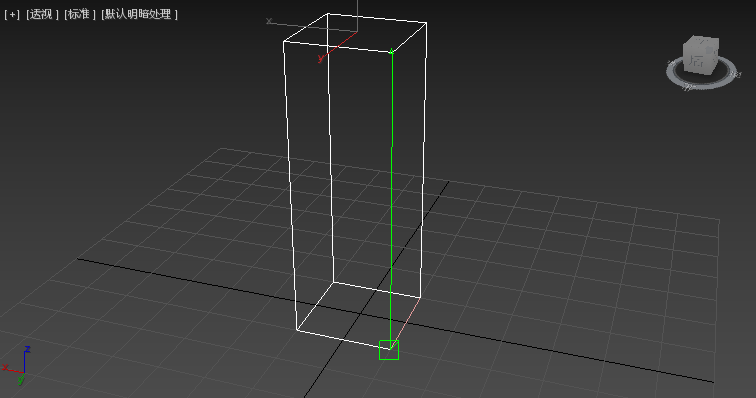

# 椅子

---

## 椅子腿

- 创建一个矩形
  
- 复制这个矩形，并改变z值抬到一定高度
  
- 选中两个矩形
  
- 到右边栏中找到 **编辑样条线** 并选择
   
- 选择其中一个平面，并到右边点击 **创建线**
  
- 然后在每一个竖面上点击四个点以构成一个平面
  
  
  
  
  
- 选中最后成型的长方体，到右边栏选择 **曲面**
  
- 选择自己喜欢的颜色就做成了一只椅子腿
  
- 通过平移复制，复制处另外三只椅子腿
  

---

## 椅子面

- 在椅子腿上方创建一个矩形，并复制一份
  
  
- 同样的方法选中两个矩形，并到右边栏点击 **编辑样条线**
- 选中其中一个平面，并到右边栏点击 **创建线**
- 同样的方法做出长方体后到右边栏选择 **曲面**
  

---

## 椅子背

- 复制先前做好的椅子面，通过选择获得椅背
  