# 期中考试步骤说明

## 创建基本模型

1. 点击“长方体”，创建正方体作为秋千支架的底部。

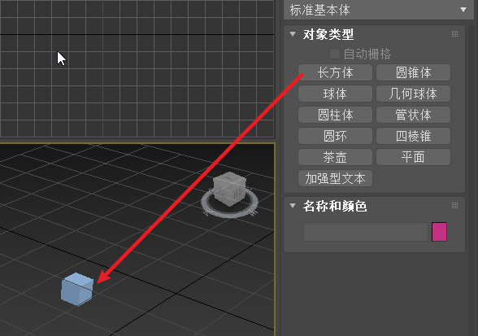

2. 点击创建好的正方体，键入 `m` 为其设置材质

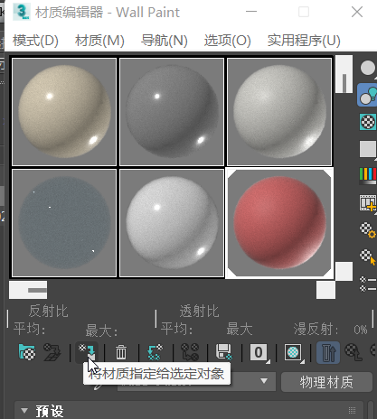

3. 点击 `圆柱体` 创建秋千的脚。

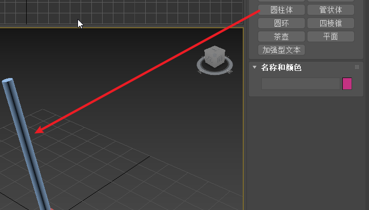

4. 将圆柱体旋转一定角度以后，放与先前的正方体重叠。选择其中一个物体，点击 `复合对象`，选择 `布尔`，然后 `添加运算对象`将另一个物体加入。选择 `合并`将两个物体合并成一个完整的脚。

​							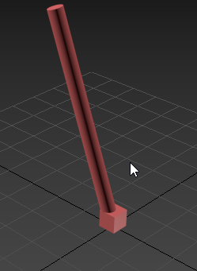

5. `shift + 鼠标拖动` 复制出一个对象，然会对其进行翻转。并将其移动到顶部与另一个对象重合

​							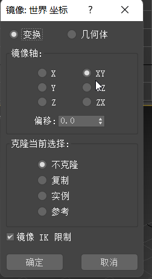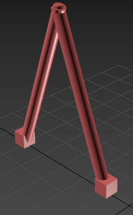

6. 相同方式将两个对象进行合并。并复制出另外一对脚

    

7. `圆柱体` 创建秋千顶部的横杠，并移动到两只脚的正上方，并通过相同方式合并。

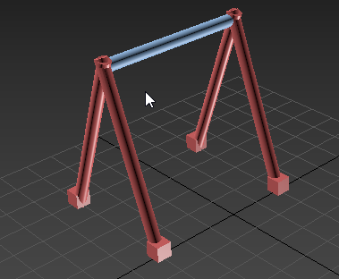

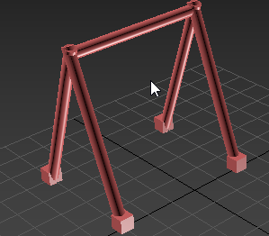

8. 创建秋千座位

    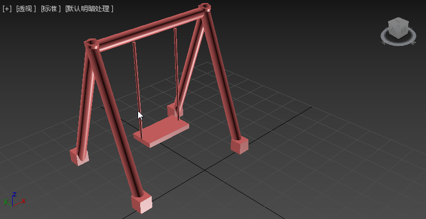

## 动画部分

1. 设置动画长度 40 帧

    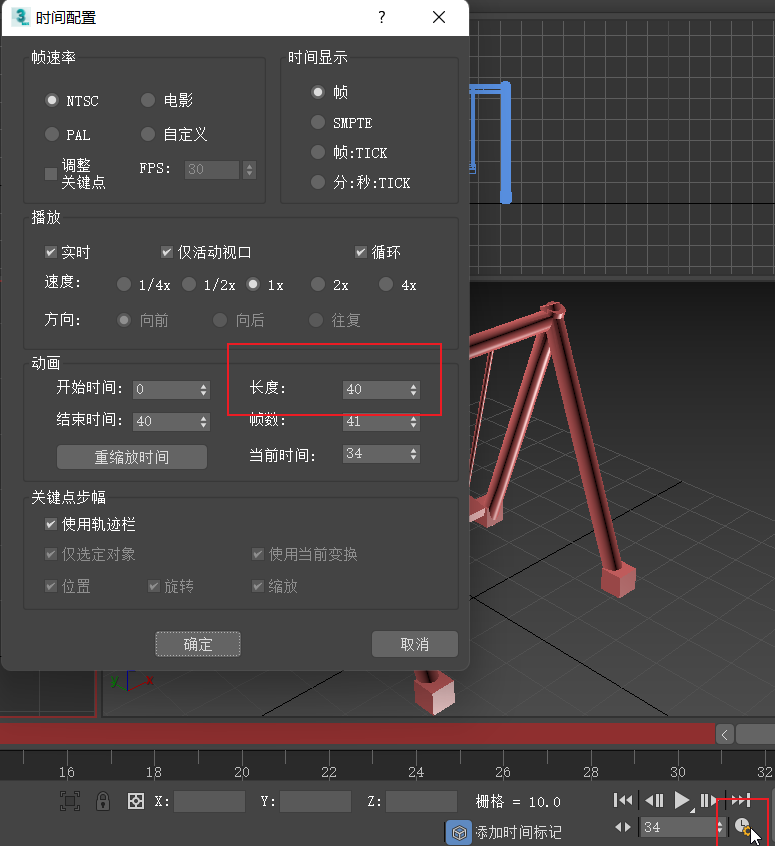

2. 选择自动关键点模式，分别拖到10帧、20帧、30帧、40帧设置秋千的不同角度

    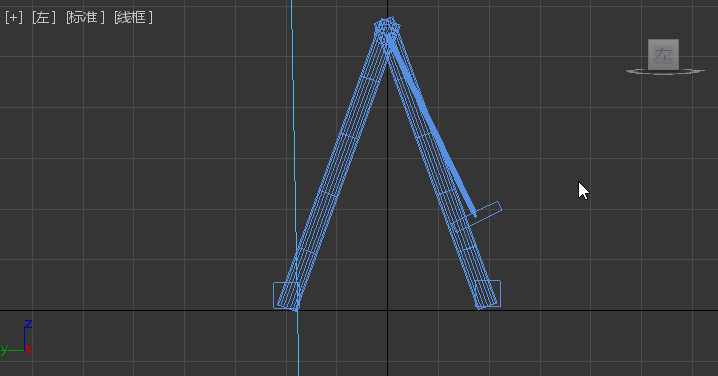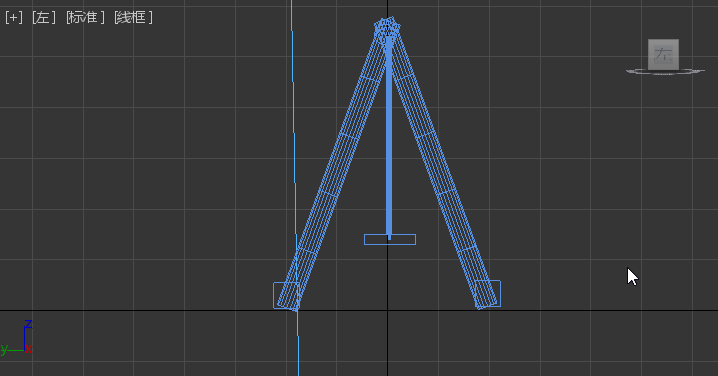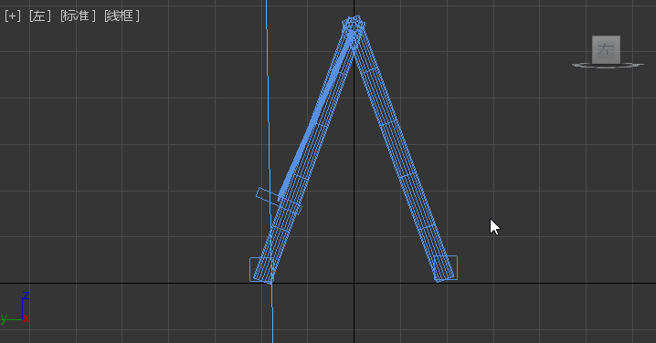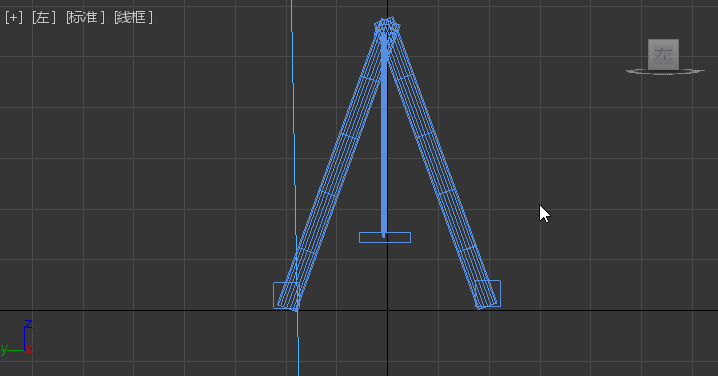

## 灯光部分

1. 添加目标灯光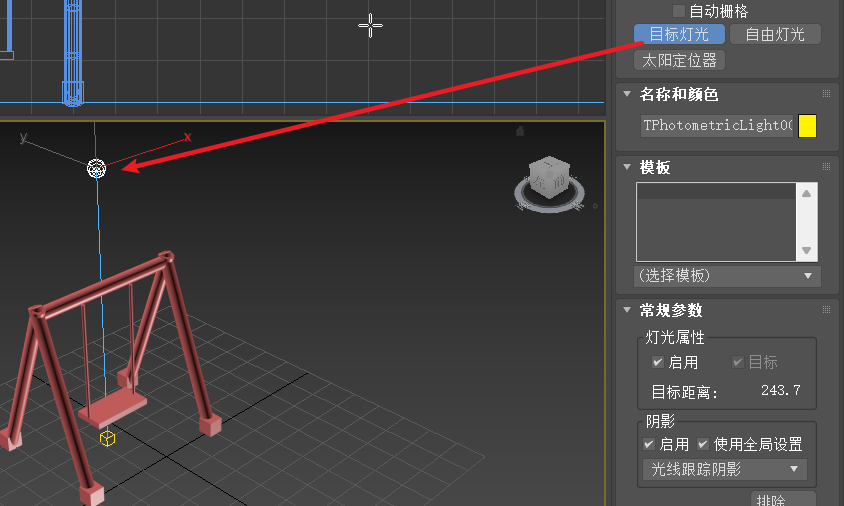

## 摄像机

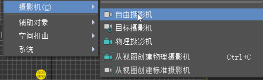