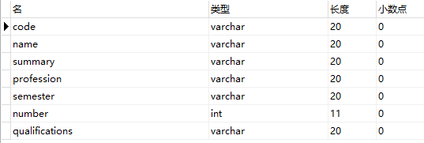
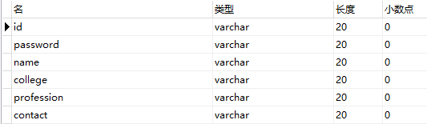

# 作品介绍

本次作业的项目，是做一个基础的选课系统的。需要实现的基本功能有如下：

- 项目的实现**必须是Java程序**，因此该次作业采用的 JavaWeb 的形式，页面显示的内容由 `html` 完成，核心的通信及选课部分由 `Java` 完成。
- 程序必须进行**身份认证**，此处理解的身份认证即使用系统的账号登录。系统分设有客户端和服务器端，无论进入哪个部分，都会先对账号密码进行校验，再判断是否拥有进入对应系统的权限。
- 程序需要使用**多线程**。我在选课部分使用到了多线程，为每一个学生的每一次选课任务创建一个线程，交由线程进行选课。而课程余量相关的问题则涉及到了线程同步，也有考虑进去并且解决。
- 程序需要**使用 `URL` `URLConnection`**，主要完成对目标资源的连接。因此在客户端即学生选课端获取选课信息处，使用了 `URLConnection` 与目标资源的连接，使用 `POST` 的方式获取信息并显示。
- 程序需要**使用 `Socket`**，完成的两个进程之间的双向通信。因此在客户端即学生选课系统端获取个人完整信息处，使用了 `Socket` 与服务器端建立连接进行双向通信，从而获取学生个人的完整信息。
- 程序需要考虑**数据库安全**，程序中涉及到对学生和课程信息的管理，因此需要对数据库的安全采取措施以免受到污染破坏。

### 服务器端

- 课程数据库：内含课程编码、课程名称、课程简介、课程适用专业、开设学期、人数限定、选课资格限定

- 学生数据库：内含学号、姓名、所在学院、专业、联系方式、已修课程、新选课程、认证信息

- 接收远程客户端的接入申请、用户验证，客户的获取数据进行显示是需要先与服务器端进行连接，服务器端会允许远程客户端的连接申请，再进行对应的数据传输。
- 管理人员对课程数据库的修改，即拥有新设课程、管理课程的权力。
- 对每位选课的学生建立线程，并且考虑人数上限的处理。

### 客户端

- 通过 `HTTP` 协议登录选课系统。
- 提供选课人员的身份信息。学生在登录系统以后，会有单独的页面与服务器端建立连接，获取该学生的完整信息。
- 浏览可选课程、拟选课程。

# 难点解决

### 线程同步

- 定义

> 线程同步：即当有一个线程在对内存进行操作时，其他线程都不可以对这个内存地址进行操作，直到该线程完成操作， 其他线程才能对该内存地址进行操作，而其他线程又处于等待状态，实现线程同步的方法有很多，临界区对象就是其中一种。

- 作用

> 线程有可能和其他线程共享一些资源，比如，内存，文件，数据库等。
>
> 当多个线程同时读写同一份共享资源的时候，可能会引起冲突。这时候，我们需要引入线程“同步”机制，即各位线程之间要有个先来后到，不能一窝蜂挤上去
>
> 抢作一团。

- 同步方式

> - 互斥对象
> - 事件对象
> - 临界区
> - 信号量

### 死锁

- 定义

> 线程有可能和其他线程共享一些资源，比如，内存，文件，数据库等。
>
> 当多个线程同时读写同一份共享资源的时候，可能会引起冲突。这时候，我们需要引入线程“同步”机制，即各位线程之间要有个先来后到，不能一窝蜂挤上去抢作一团。

- 条件

> **1）互斥条件：**指进程对所分配到的资源进行排它性使用，即在一段时间内某资源只由一个进程占用。如果此时还有其它进程请求资源，则请求者只能等待，直至占有资源的进程用毕释放。
>
> **2）请求和保持条件：**指进程已经保持至少一个资源，但又提出了新的资源请求，而该资源已被其它进程占有，此时请求进程阻塞，但又对自己已获得的其它资源保持不放。
>
> **3）不剥夺条件：**指进程已获得的资源，在未使用完之前，不能被剥夺，只能在使用完时由自己释放。
>
> **4）环路等待条件：**指在发生死锁时，必然存在一个进程——资源的环形链，即进程集合{P0，P1，P2，···，Pn}中的P0正在等待一个P1占用的资源；P1正在等待P2占用的资源，……，Pn正在等待已被P0占用的资源。

- 原因

> #### 竞争资源引起进程死锁
>
> 当系统中供多个进程共享的资源如打印机、公用队列的等，其数目不足以满足诸进程的需要时，会引起诸进程对资源的竞争而产生死锁。

- 预防

> 只要打破四个必要条件之一就能有效预防死锁的发生：
>
> - 打破互斥条件：改造[独占性资源](https://baike.baidu.com/item/独占性资源/8141009)为虚拟资源，大部分资源已无法改造。
> - 打破不可抢占条件：当一进程占有一独占性资源后又申请一独占性资源而无法满足，则退出原占有的资源。
> - 打破占有且申请条件：采用资源预先分配策略，即进程运行前申请全部资源，满足则运行，不然就等待，这样就不会占有且申请。
> - 打破循环等待条件：实现资源有序分配策略，对所有设备实现分类编号，所有进程只能采用按序号递增的形式申请资源。

### 数据库安全

- 定义

> [数据库系统](https://baike.baidu.com/item/数据库系统/215176)的[安全特性](https://baike.baidu.com/item/安全特性/10840670)主要是针对数据而言的，包括[数据独立性](https://baike.baidu.com/item/数据独立性/2369087)、[数据安全性](https://baike.baidu.com/item/数据安全性/4287416)、[数据完整性](https://baike.baidu.com/item/数据完整性/110071)、[并发控制](https://baike.baidu.com/item/并发控制/3543545)、故障恢复等几个方面。

- 安全问题

> （1）黑客通过B/S应用，以Web服务器为跳板，窃取数据库中数据；传统解决方案对应用访问和数据库访问协议没有任何控制能力，比如:SQL注入就是一个典型的数据库黑客攻击手段。
>
> （2）数据泄露常常发生在内部，大量的运维人员直接接触敏感数据，传统以防外为主的[网络安全解决方案](https://baike.baidu.com/item/网络安全解决方案/8772233)失去了用武之地。

- 安全策略

> - 使用安全的密码策略
> - 使用安全的账号策略
> - 加强数据库日志的记录
> - 管理扩展[存储过程](https://baike.baidu.com/item/存储过程)
> - 使用协议加密
> - 不要让人随便[探测](https://baike.baidu.com/item/探测)到您的TCP/IP端口
> - 修改TCP/IP使用的端口
> - 拒绝来自1434端口的探测
> - 对网络连接进行IP限制