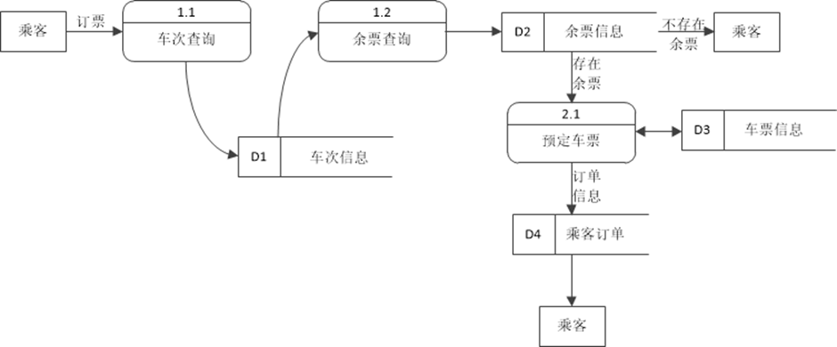
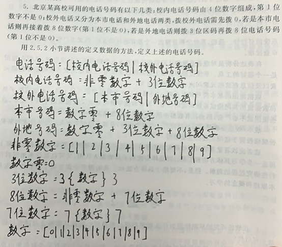
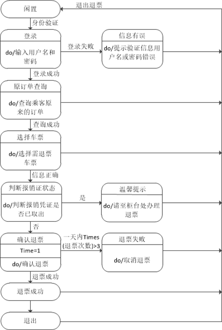
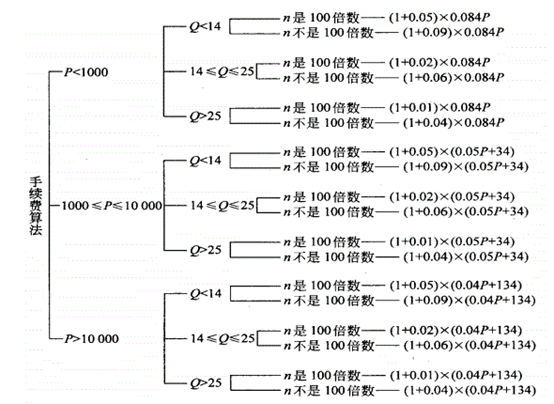

> ## 免责声明：
>
> 1. 此份整理是 **李浩然** 同志整理内容的 markdown 转，若文中有误，请直接联系前者
> 2. 整理是我的个人行为，查看是你的个人行为，若因本份整理的内容导致考试丢分，概不负责
> 3. 文档中的章节序号，与书本序号不严格相同

> ## 计科班大题内容：
>
> 1. 判定树
> 2. 环形复杂度
> 3. 数据流图
> 4. 状态转换图
> 5. 六个库表


# 第一章 软件工程概述


## 1.1 软件危机


### 1.1.1 软件危机概念

> **软件危机**是指在计算机软件的**开发和维护过程中**所遇到的一些列**严重问题**。

软件危机包含的方面：

- 如何**开发**软件，以满足对软件日益增长的需求
- 如何**维护**数量不断膨胀的已有软件


### 1.1.2 软件危机的典型表现 ⭐

（至少记三点，wyf如是说）

- `成本和进度估算不准确`：对软件开发成本和进度的估计常常很不准确
- `用户不满意`：用户对已完成的软件系统不满意的现象经常发生
- `软件质量不佳`：软件产品的质量往往靠不住
- `不可维护`：软件常常是不可维护的
- `缺少文档`：软件通常没有适当的文档资料
- `软件成本占比的上升`：软件成本在计算机系统中总成本所占比的比例逐年上升
- `软件开发速率跟不上`：软件开发生产率提高的速度，远远跟不上计算机应用迅速普及深入的趋势。

​	

### 1.1.3 产生软件危机的原因

> 软件危机产生的原因，一方面与软件本身的特点有关，另一方面也和软件开发和维护的方法不正确有关。

软件本身的特点给开发和维护带来了客观困难：

- 软件是计算机系统中的逻辑部件，缺乏“可见性”
- 规模庞大，程序复杂

软件开发和维护过程中的错误认识和做法：

- 忽略需求分析，认为软件开发等于编写程序
- 轻视软件维护

​	

### 1.1.4 消除软件危机的途径

- 对计算机软件有一个正确的认识（软件≠程序）
- 必须充分认识到软件开发不是某种个体劳动的神秘技巧，而应该是一种组织良好、管理严密、各类人员协同配合、共同完成的工程项目
- 推广使用在实践中总结出来的开发软件的成功技术和方法
- 开发和使用更好的软件工具。


> 软件是程序、数据及相关文档的完整集合。

- 程序是能够完成预定功能和性能的可执行的指令序列
- 数据是使程序能够适当地处理信息的数据结构
- 文档是开发、使用和维护程序所需要的图文资料。


## 1.2 软件工程


### 1.2.1 软件工程的概念

概括：软件工程是指导计算机软件开发和维护的一门工程学科。

> 1993年IEEE的定义：软件工程是把系统的、规范的、可度量的途径应用于软件开发、运行和维护过程，也就是把工程应用于软件；研究前者提到的途径。


### 1.2.2 软件工程的本质特性

- 软件工程关注于大型程序的构造
- 软件工程的中心课题是控制复杂性
- 软件经常变化
- 开发软件的效率非常重要
- 和谐地合作是开发软件的关键
- 软件必须有效地支持它的用户
- 在软件工程领域中通常由具有一种文化背景的人替具有另一种文化背景的人创造产品。


### 1.2.3 软件工程的基本原理

- 用分阶段的生命周期计划严格管理
- 坚持进行阶段评审
- 实行严格的产品控制
- 采用现代程序设计技术
- 结果应能清楚地审查
- 开发小组的人员应该少而精
- 承认不断改进软件工程实践的必要性


### 1.2.4 软件工程方法学

> 软件工程方法学包含3个要素：方法、工具和过程。

- 方法是完成软件开发的各项任务的技术方法，回答“怎样做”的问题

- 工具是为运用方法而提供的自动的或半自动的软件工程支撑环境

- 过程是为了获得高质量的软件所需要完成的一系列任务的框架，它规定了完成各项任务的工作步骤。

目前使用的最广泛的软件方法工程学，分别是传统方法学和面向对象方法学。


#### 1.2.4.1 传统方法学

传统方法学：也称为生命周期方法学或结构化范型

优点：

- 把软件生命周期划分成基干个阶段，每个阶段的任务相对独立，而且比较简单，便于不同人员分工协作，从而降低了整个软件开发过程的困难程度。

缺点：

- 当软件规模庞大时，或者对软件的需求是模糊的或会承受时间而变化的时候，发开出的软件往往不成功；而且维护起来仍然很困难。

#### 1.2.4.2 面向对象方法学

优点：

- 降低了软件产品的复杂性；
- 提高了软件的可理解性；
- 简化了软件的开发和维护工作；
- 促进了软件重用。


## 1.3 软件生命周期


### 1.3.1 软件生命周期概念

> 软件生命周期由软件定义、软件开发和运行维护（也称为软件维护）3个时期组成。

软件定义划分为三个阶段：问题定义；可行性研究；需求分析。

软件开发划分为四个阶段：总体设计；详细设计；编码和单元测试；综合测试。

运行维护划分为一个阶段：软件维护


## 1.4 软件过程⭐

> 软件过程是为了开发出高质量的软件产品所需完成的一系列任务的框架，它规定了完成各项任务的工作步骤。

概括地说，软件过程描述了为了开发出客户需要的软件，什么人、在什么时候、做什么事以及怎样做这些事以实现某一个特定的具体目标。


### 1.4.1 瀑布模型

瀑布模型是将软件生存周期的各项活动规定为按固定顺序而连接的若干阶段工作。	

**特点：**

1. 阶段间具有顺序性和依赖性；
2. 推迟实现的观点；
3. 质量保证的观点。

**优点：**

1. 可强迫开发人员采用规范的方法
2. 严格的规定了每个阶段必须提交的文档
3. 要求每个阶段交出的所有产品都必须经过质量保证小组的仔细验证。

**缺点：**

1. “瀑布模型是由文档驱动的”，几乎完全依赖书面的规格说明，很可能导致最终开发出来的软件产品不能真正满足用户的需要。

> ## [瀑布模型_百度百科 ](https://baike.baidu.com/item/瀑布模型/9817778)
>
> **优点**：
>
> - 为项目提供了按阶段划分的检查点。
> - 当前一阶段完成后，您只需要去关注后续阶段。
> - 可在[迭代模型](https://baike.baidu.com/item/迭代模型)中应用瀑布模型。
> - 它提供了一个模板，这个模板使得分析、设计、编码、测试和支持的方法可以在该模板下有一个共同的指导。
>
> **缺点：**
>
> - 各个阶段的划分完全固定，阶段之间产生大量的文档，极大地增加了工作量。
> - 由于开发模型是线性的，用户只有等到整个过程的末期才能见到开发成果，从而增加了开发风险。
> - 通过过多的强制完成日期和里程碑来跟踪各个项目阶段。
> - 瀑布模型的突出缺点是不适应用户需求的变化。


### 1.4.2 快速原型模型

快速原型是快速建立起来的可以在计算机上运行的程序，它所能完成的功能往往是最终产品能完成的功能的一个子集。

**优点：**

- 开发过程的后续阶段不会因为发现了规格说明文档的错误而进行较大的返工
- 减少了在后续阶段需要改正前面阶段所犯错误的可能性

> ## [快速原型模型_百度百科](https://baike.baidu.com/item/快速原型模型)
>
> **优点：**
>
> - 克服[瀑布模型](https://baike.baidu.com/item/瀑布模型)的缺点，减少由于[软件需求](https://baike.baidu.com/item/软件需求)不明确带来的开发风险。
>
> **缺点：**
>
> - 所选用的开发技术和工具不一定符合主流的发展；
> - 快速建立起来的系统结构加上连续的修改可能会导致产品质量低下。


### 1.4.3 增量模型

把软件产品作为一系列的增量构件来设计、编码、集成和测试。每个构建由多个相互作用的模块构成并且能够完成特定的功能。

**优点：**

- 能在较短时间内向用户提交可完成部分工作的产品
- 逐步增加产品功能可以使用户有较充裕的时间学习和适应新产品，从而减少一个全新的软件可能给客户组织带来的冲击

**缺点：**

- 新的增量构建集成到现有软件体系结构中时，必须不破坏原来已经开发的产品。


# 第二章 可行性研究


## 2.1 可行性研究的任务⭐

> 可行性研究的目的，就是用最小的代价在尽可能短的时间内确定问题是否能够解决。

> 可行性研究最根本的任务是对以后的行动方针提出建议。

- 首先需要分析和澄清问题定义
- 在澄清了问题定义之后，分析员应该导出系统的逻辑模型。然后从系统逻辑模型出发，探索若干种可供选择的主要解法(即系统实现方案)。对每种解法都应该仔细研究它的可行性。
    - 技术可行性：使用现有的技术能实现这个系统吗
    - 经济可行性：这个系统的经济效益能超过它的开发成本吗
    - 操作可行性：系统的操作方式在这个用户组织内行得通吗
- 必要时还应该从法律、社会效益等更广泛的方面研究每种解法的可能性。


## 2.2 可行性研究过程

- 复查系统规模和目标
- 研究目前正在使用的系统
- 导出新系统的高层逻辑模型
- 进一步定义问题
- 导出和评价供选择的解法
- 推荐行动方针
- 草拟开发计划
- 书写文档提交审查。


## 2.4 数据流图


### 2.4.0 会画数据流图 ⭐



### 2.4.1 数据流图的概念

> 数据流图(DFD)是一种图形化技术，它描绘信息流和数据从输入移动到输出的过程中所经受的变换。

在数据流图中没有任何具体的物理部件，它只是描绘数据在软件中流动和被处理的逻辑过程。

数据流图是系统逻辑功能的图形表示。


### 2.4.2 数据流图的符号

> 数据流与程序流程图中用箭头表示的控制流有本质不同，千万不要混淆。在数据流图中应该描绘所有可能的数据流向，而不应该描绘出现某个数据流的条件。

（图见 P41）


### 2.4.3 数据流图的用途

- 画数据流图的基本目的是利用它作为交流信息的工具。

```
数据流图应该分层，并且在把功能级数据流图细化后得到的处理超过9个时，应该采用画分图的办法，也就是把每个主要功能都细化为一张数据流分图，而原有的功能级数据流图用来描绘系统的整体逻辑概貌。
```

- 数据流图的另一个主要用途是作为分析和设计的工具。

```
当用数据流图辅助物理系统的设计时，以图中不同处理的定时要求为指南，能够在数据流图上画出许多组自动化边界，每组自动化边界可能意味着一个不同的物理系统，因此可以根据系统的逻辑模型考虑系统的物理实现。
```


## 2.5 数据字典


### 2.5.0 会写数据字典 ⭐


### 2.5.1 数据字典的定义

> 数据字典是关于数据的信息的集合，也就是对数据流图中包含的所有元素的定义的集合。


### 2.5.2 数据字典的内容

数据字典包含下列4类元素的定义：数据流；数据流分量(即数据元素)；数据存储；处理。


### 2.5.3 定义数据的方法

> 数据字典中的定义就是对数据自顶向下的分解。

由数据元素组成数据的方式只有下述三种基本类型：

- 顺序，即以确定次序连接两个或多个分量
- 选择，即从两个或多个可能的元素中选取一个
- 重复，即把指定的分量重复零次或多次
- 可选，即一个分量是可有可无的(重复零次或一次)。


### 2.5.4 数据字典的符号

- `=`意思是等价于(或定义为)
- `+`意思是和(即，连接两个分量)
- `[]`意思是或(即，从方括弧内列出的若干个分量中选择一个)，通常用“|”号隔开供选择的分量
- `{}`意思是重复(即，重复花括弧内的分量)
- `()`意思是可选(即，圆括弧里的分量可有可无)。


### 2.5.5 数据字典的练习 




# 第三章 需求分析


## 3.1 确定对系统的综合要求

- 功能需求：这方面的需求指定系统必须提供的服务；
- 性能需求：性能需求指定系统必须满足的定时约束或容量约束，通常包括速度（响应时间）、信息量速率、主存容量、磁盘容量、安全性等方面的需求；
- 可靠性和可用性需求：可靠性需求定量地指定系统的可靠性；
- 出错处理需求：这类需求说明系统对环境错误应该怎样响应；
- 接口需求：接口需求描述应用系统与它的环境通信的格式；
- 约束：设计约束或实现约束描述在设计或实现应用系统时应遵守的限制条件；
- 逆向需求：逆向需求说明软件系统不应该做什么；
- 将来可能提出的要求：应该明确地列出那些虽然不属于当前系统开发范畴，但是据分析将来很可能会提出来的要求。


## 3.2 访谈


### 3.2.1 正式访谈

正式访谈时，系统分析员将提出一些事先准备好的具体问题。

### 3.2.2 非正式访谈

在非正式访谈中，分析员将提出一些用户可以自由回答的开放性问题，以鼓励被访问人员说出自己的想法。


## 3.3 各种图的绘制⭐

- 数据模型（ER图）
- 功能模型（数据流图）
- 行为模型（状态图）



## 3.4 联系


### 3.4.1 一对一

  \* 一个人对应一张身份证，一张身份证对应一个人


### 3.4.2 一对多

  \* 一个班级拥有多个学生，一个学生只能够属于某个班级


### 3.4.3 多对多

  \* 一个学生可以选修多门课程，一个课程可以被多个学生选修


## 3.5 数据规范化⭐

第一范式：每个属性值都必须是原子值，即仅仅是一个简单值而不含内部结构。

第二范式：满足第一范式条件，而且每个非关键字属性都由整个关键字决定（而不是由关键字的一部分来决定）。

第三范式：符合第二范式的条件，每个非关键字属性都仅由关键字决定，而且一个非关键字属性不能仅仅是对另一个非关键字属性的进一步描述（即一个非关键字属性值不依赖于另一个非关键字属性值）。

范式越高，冗余度越小，表越多，理解越困难。


# 第五章 总体设计

> 总体设计的目的就是回答“**概括地说，系统应该如何实现**”这个问题。


## 5.1 设计过程⭐

- 设想供选择的方案；
- 选取合理的方案；
- 推荐最佳方案；
- 功能分解；
- 设计软件结构；
- 设计数据库；
- 制定测试计划
- 书写文档（包括系统说明，用户手册，测试计划，详细的实现计划，数据库设计结果）；
- 审查和复查。


## 5.2 设计原理


### 5.2.1 模块化

就是把程序划分成独立命名且可独立访问的模块，每个模块完成一个子功能，把这些模块集成起来构成一个整体，可以完成指定的功能满足用户的需求

### 5.2.2 抽象

抽象就是抽出事物的本质特性而暂时不考虑它们的细节。

### 5.2.3 逐步求精

为了能集中精力解决主要问题而尽量推迟对问题细节的考虑


### 5.2.4 耦合⭐

> 耦合是对一个软件结构内不同模块之间互连程度的度量。耦合强弱取决于模块间接口的复杂程度，进入或访问一个模块的点，以及通过接口的数据。

> **尽量使用数据耦合，少用控制耦合和特征耦合，限制公共环境耦合的范围，完全不适用内容耦合**


#### 5.2.4.1 **数据耦合** - 低耦合

如果两个模块彼此间通过参数交换信息，而且交换的信息仅仅是数据。


#### 5.2.4.2 **数据耦合** - 中耦合

如果两个模块彼此间通过参数交换信息，传递的信息中有控制信息


#### 5.2.5.3 **特征耦合**

当把整个数据结构作为参数传递而被调用的模块只需要使用其中一部分数据元素


#### 5.2.4.4 **公共环境耦合（全局变量）**

当两个或多个模块通过一个公共数据环境相互作用时，它们之间的耦合称为公共环境耦合。

- 较松散的耦合：一个模块往公共环境送数据，另一个模块从公共环境取数据。
- 介于数据耦合和控制耦合之间：两个模块都既往公共环境送数据又从公共环境取数据。


#### 5.2.4.5 **内容耦合** - 最高程度的耦合

- 一个模块访问另一个模块的内部数据
- 一个模块不通过正常入口而转到另一个模块的内部
- 两个模块有一部分程序代码重叠
- 一个模块有多个入口（意味着一个模块有多个功能）


### 5.2.5 内聚⭐

> 内聚标志着一个模块内各个元素彼此结合的紧密程度，它是信息隐藏和局部化概念的自然拓展。简单地说，理想内聚的模块只做一件事情。

- 低内聚
    - `0分`偶然内聚：如果一个模块完成一组任务，这些任务彼此间即使有关系，关系也是很松散的
    - `1分`逻辑内聚：如果一个模块完成的任务在逻辑上属于相同或相似的一类
    - `3分`时间内聚：如果一个模块包含的任务必须在同一段时间内执行
- 中内聚
    - `5分`过程内聚：如果一个模块内的处理元素是相关的，而且必须以特定次序执行
    - `7分`通信内聚：如果模块中所有元素都使用同一个输入数据和（或）产生同一个输出数据

- 高内聚
    - `9分`顺序内聚：如果一个模块内的处理元素和同一个功能密切相关，而且这些处理必须顺序执行
    - `10分`功能内聚：如果模块内所有处理元素属于一个整体，完成一个单一的功能


## 5.3 启发规则

- 改进软件结构提高模块独立性；
- 模块规模应该适中；
- 深度、宽度、扇出和扇入都应适当；
- 模块的作用域应该在控制域之内；
- 力争降低模块接口的复杂程度；
- 设计单入口单出口的模块；
- 模块功能应该可以预测。


## 5.4 层次图 P102


# 第六章 详细设计

>  详细设计阶段的**根本目标是确定应该怎样具体地实现所要求的系统**，也就是说，经过这个阶段的设计工作，应该得出对目标系统的精确描述，从而在编码阶段可以把这个描述直接翻译成用某种程序设计语言书写的程序。
>
> **代码质量由详细设计分析人决定的**


## 6.2 设计问题

- 系统响应时间；
- 用户帮助设施；
- 出错信息处理；
- 命令交互。

## 6.3 判定树 P129


## 6.5 程序复杂程度


### 6.5.1 McCabe 方法

McCabe方法根据程序控制流的复杂程度定量度量程序的复杂程度，这样度量出的结果称为程序的环形复杂度。


**计算环形复杂度**

1. 流图中线性无关的区域数等于环形复杂度
2. 流图G的环形复杂度 `V(G) = E - N + 2` ，E是边数，N是点数
3. 流图G的环形复杂度 `V(G) = P  + 1`，P是判定节点的数目

图见P138


**画流程图，转换**


### 6.5.2 Halstead方法

Halstead方法根据程序中运算符和操作数的总数来度量程序的复杂程度。


## 6.6 练习

P142 7


